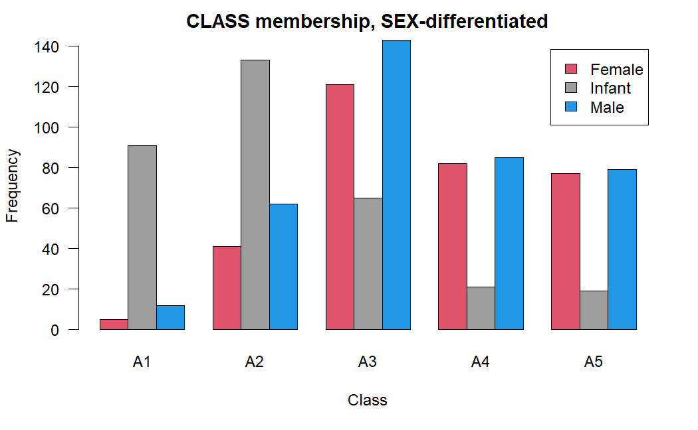
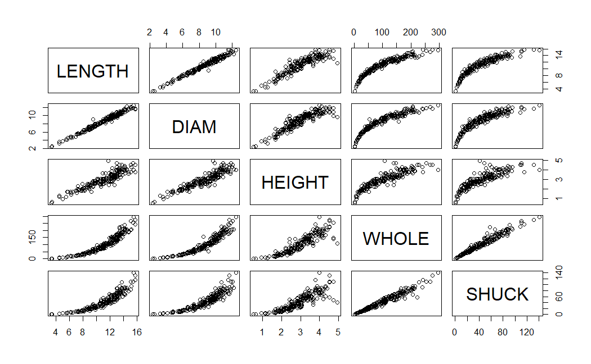
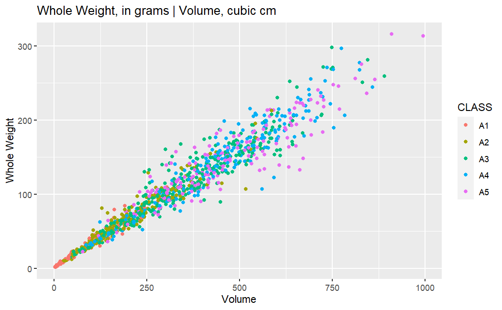
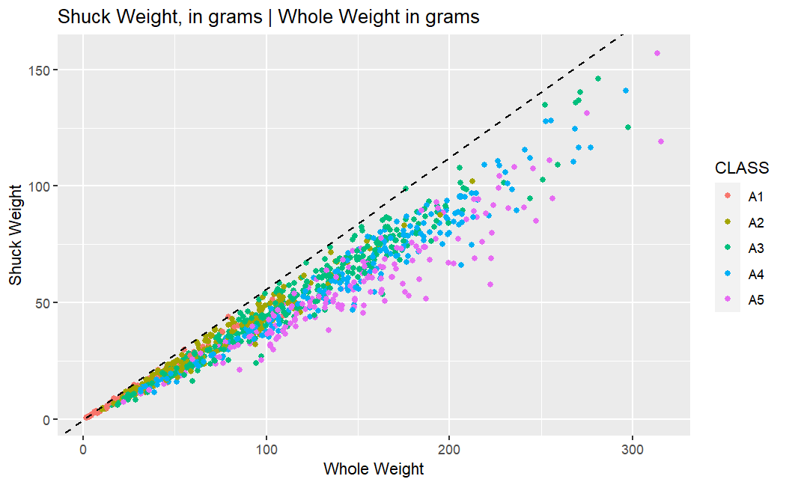
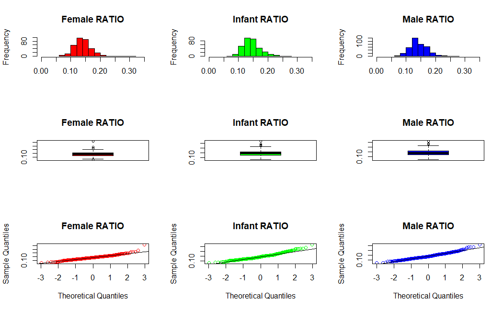
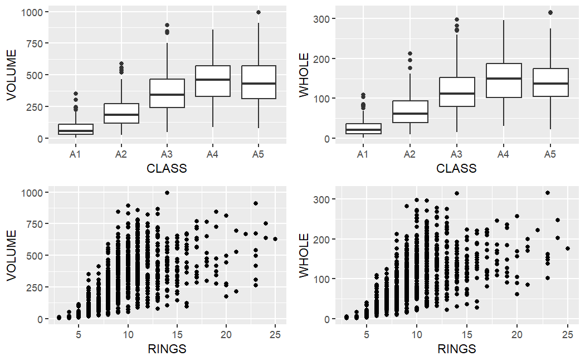
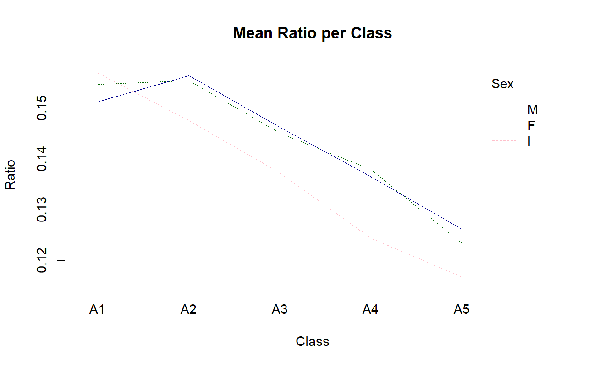
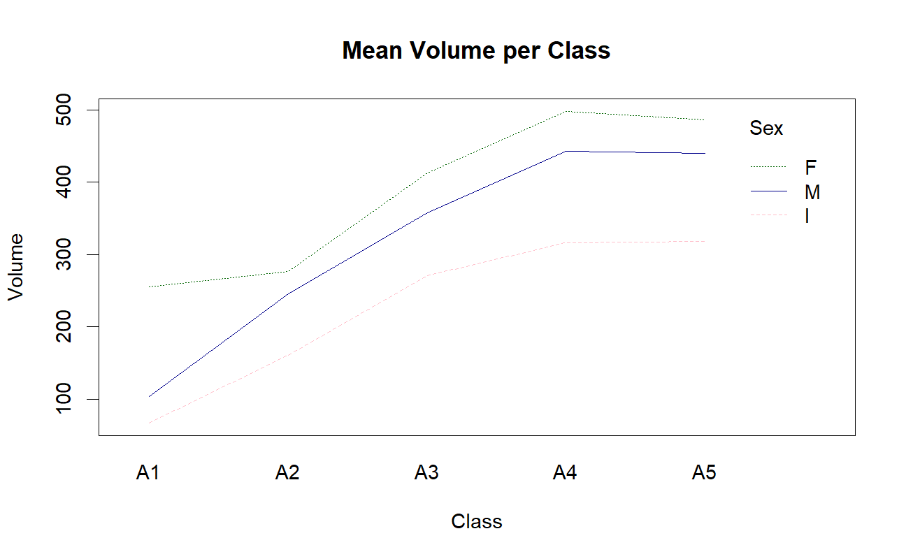
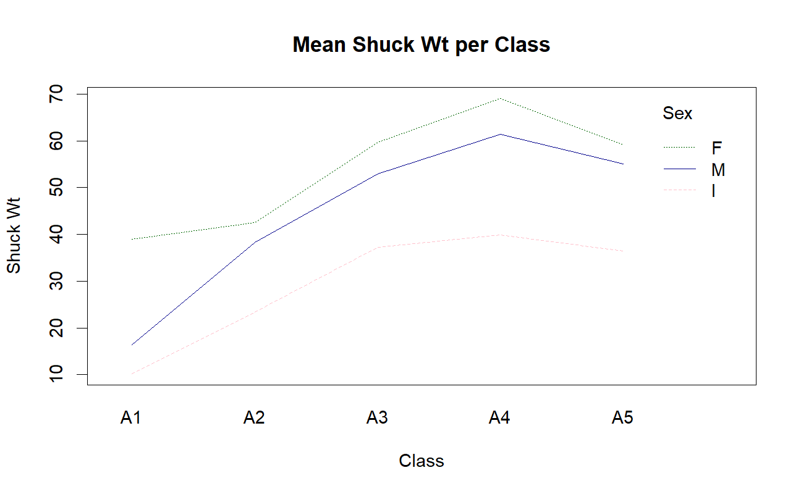
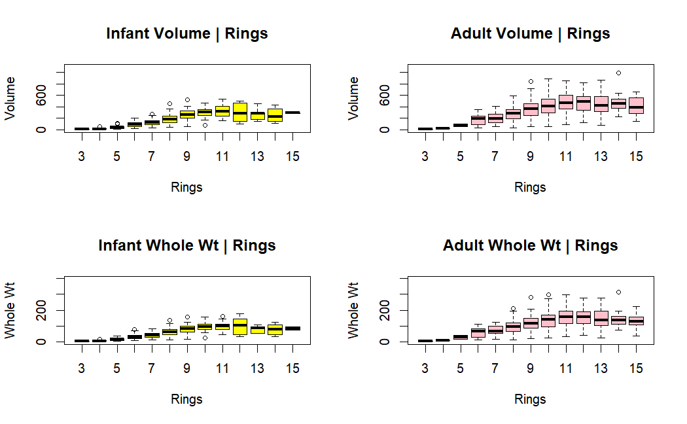

### Description:  
The assignment data are derived from an observational study of abalones. The intent of the investigators was to predict the age of abalone from physical measurements thus avoiding the necessity of counting growth rings for aging. Ideally, a growth ring is produced each year of age. Currently, age is determined by drilling the shell and counting the number of shell rings using a microscope. This is a difficult and time consuming process. Ring clarity can be an issue. At the completion of the breeding season sexing abalone can be difficult. Similar difficulties are experienced when trying to determine the sex of immature abalone. Exploratory data analysis was done to gain insights on alternative age identifiers before abolone harvesting.

### Program Setup

```
# a) Load the ggplot2 and gridExtra packages.

library(ggplot2)
library(gridExtra)
library(knitr)

# b) Use read.csv() to read the abalones.csv into R, assigning the data frame to "mydata."

mydata <- read.csv("abalones.csv", sep = ",", stringsAsFactors = TRUE)


# c) Use the str() function to verify the structure of "mydata." You should have 1036 observations
# of eight variables.

str(mydata)

# d) Define two new variables, VOLUME and RATIO. Use the following statements to define VOLUME and
# RATIO as variables appended to the data frame "mydata."

mydata$VOLUME <- mydata$LENGTH * mydata$DIAM * mydata$HEIGHT
mydata$RATIO <- mydata$SHUCK / mydata$VOLUME

```

'data.frame':	1036 obs. of  8 variables:
 $ SEX   : Factor w/ 3 levels "F","I","M": 2 2 2 2 2 2 2 2 2 2 ...  
 $ LENGTH: num  5.57 3.67 10.08 4.09 6.93 ...  
 $ DIAM  : num  4.09 2.62 7.35 3.15 4.83 ...  
 $ HEIGHT: num  1.26 0.84 2.205 0.945 1.785 ...  
 $ WHOLE : num  11.5 3.5 79.38 4.69 21.19 ...  
 $ SHUCK : num  4.31 1.19 44 2.25 9.88 ...  
 $ RINGS : int  6 4 6 3 6 6 5 6 5 6 ...  
 $ CLASS : Factor w/ 5 levels "A1","A2","A3",..: 1 1 1 1 1 1 1 1 1 1 ...  

 ### EDA
 
 **1a.** Use *summary()* to obtain and present descriptive statistics from mydata.  Use *table()* to present a frequency table using CLASS and RINGS. There should be 115 cells in the table you present.

 ```
 summary(mydata)

table_1a <- with(mydata, table(CLASS, RINGS))
table_1a
```
**OUTPUT**  

| SEX | LENGTH | DIAM | HEIGHT | WHOLE | SHUCK | RINGS | CLASS |
|:---:|:------:|:----:|:------:|:-----:|:-----:|:-----:|:-----:|
|  F  |  2.73  | 1.995|  0.525 | 1.625 | 0.5625|  3.000|  A1   |
|  I  |  9.45  | 7.350|  2.415 | 56.484| 23.3006| 8.000 |  A2   |
|  M  | 11.45  | 8.925|  2.940 |101.344| 42.5700| 9.000 |  A3   |
|     | 11.08  | 8.622|  2.947 |105.832| 45.4396| 9.993 |  A4   |
|     | 13.02  |10.185|  3.570 |150.319| 64.2897|11.000 |  A5   |


| VOLUME | RATIO   |
|:------:|:-------:|
|  3.612 | 0.06734 |
|163.545 | 0.12241 |
|307.363 | 0.13914 |
|326.804 | 0.14205 |
|463.264 | 0.15911 |
|995.673 | 0.31176 |


| RINGS | CLASS |  3 |  4 |  5 |  6 |  7 |  8 |  9 | 10 | 11 | 12 | 13 | 14 | 15 | 16 | 17 | 18 | 19 | 20 | 21 | 22 | 23 | 24 | 25 |
|:-----:|:-----:|---|---|---|---|---|---|---|---|---|---|---|---|---|---|---|---|---|---|---|---|---|---|---|
|   A1  |   9   | 8 | 24| 67|  0|  0|  0|  0|  0|  0|  0|  0|  0|  0|  0|  0|  0|  0|  0|  0|  0|  0|  0|  0|
|   A2  |   0   | 0 |  0|  0| 91|145|  0|  0|  0|  0|  0|  0|  0|  0|  0|  0|  0|  0|  0|  0|  0|  0|  0|  0|
|   A3  |   0   | 0 |  0|  0|  0|  0|182|147|  0|  0|  0|  0|  0|  0|  0|  0|  0|  0|  0|  0|  0|  0|  0|  0|
|   A4  |   0   | 0 |  0|  0|  0|  0|  0|  0|125| 63|  0|  0|  0|  0|  0|  0|  0|  0|  0|  0|  0|  0|  0|  0|
|   A5  |   0   | 0 |  0|  0|  


**Summary**

The data frame is made up of nominal data of R character data types for the sex and class columns. The remaining columns are ratio data in the form of numeric and integer R data types. The frequency of ring count appears to be dependent on the abalones class. For instance, in class A1 the abalones fall between 3 to 6 rings; this range is skewed to the left because it drops off to zero at 7 rings. For classes A2-A4 the frequencies of ring counts is well clustered and increases as class number increases. Class A5 has a right skew with outliers likely to appear at 18 or more rings

**1b.** Generate a table of counts using SEX and CLASS. Add margins to this table. Apply *table()* first, then pass the table object to *addmargins()* Lastly, present a barplot of these data; ignoring the marginal totals.

```
table_1b <- with(mydata, table(SEX, CLASS))
table_1b
addmargins(table_1b)

barplot(table_1b, beside =TRUE, legend.text= c("Female", "Infant", "Male"), main="CLASS membership, SEX-differentiated", ylab ="Frequency", xlab ="Class", las=1, col=c(2, 8, 4))
```


| SEX  | A1 | A2 | A3 | A4 | A5 | Sum |
|------|----|----|----|----|----|-----|
|   F  |  5 | 41 |121 | 82 | 77 | 326 |
|   I  | 91 |133 | 65 | 21 | 19 | 329 |
|   M  | 12 | 62 |143 | 85 | 79 | 381 |
| Total|108 |236 |329 |188 |175 |1036 |


**Summary**  
Male abalones slightly outnumber female abalones in all classes. Infant abalones make up a large portion of class A1 and A2 which leads me to believe that the class is characterized by age. Classes A4 and A5 make up a large portion of adult abalones compared to infants, leading me to believe that they are the matured class. Also, this chart leads me to believe that the abalones are not able to be identified by sex until they reach adulthood because of the presence of an infant category 

**1c.** Select a simple random sample of 200 observations from "mydata" and identify this sample as "work." Use *set.seed(123)* prior to drawing this sample. 
Using "work", construct a scatterplot matrix of variables 2-6 with *plot(work[, 2:6])* (these are the continuous variables excluding VOLUME and RATIO). The sample "work" will not be used in the remainder of the assignment. 

```
set.seed(123)
work <- mydata[sample(1:nrow(mydata), 200, replace=FALSE),]

plot(work[, 2:6])
```



**2a** Use "mydata" to plot WHOLE versus VOLUME. Color code data points by CLASS.

```
ggplot(data=mydata, aes(VOLUME, WHOLE))+
  geom_point(aes(colour = CLASS))+
  labs(title = "Whole Weight, in grams | Volume, cubic cm", x="Volume", y= "Whole Weight")
```



**2b** Use "mydata" to plot SHUCK versus WHOLE with WHOLE on the horizontal axis. Color code data points by CLASS. As an aid to interpretation, determine the maximum value of the ratio of SHUCK to WHOLE.  Add to the chart a straight line with zero intercept using this maximum value as the slope of the line. 

```
max <- max(mydata$SHUCK/mydata$WHOLE)

ggplot(data=mydata, aes(WHOLE, SHUCK))+
  geom_point(aes(colour = CLASS))+
  geom_abline(slope = max, intercept = 0, lty=2)+
  labs(title = "Shuck Weight, in grams | Whole Weight in grams", x="Whole Weight", y= "Shuck Weight")
```


**Summary:**  
The first plot illustrates more clustering by class. The A1 class is clustered toward the origin and as the plot extends outward to the right the clustering by classes continues this pattern to a degree. This pattern makes sense, because an increase in volume is directly proportional to increase of overall weight of abalones as they increase in age and grow larger. However, the second plot shows more variability by class. The shuck to whole weight has a larger variability compared to the first plot. This appears most prominently in classes A4 and A5 although all classes exhibit this behavior. Since shuck weight is is part of whole weight the high variability of weight in each age class suggests that they grow at different rates.

**3a** Use "mydata" to create a multi-figured plot with histograms, boxplots and Q-Q plots of RATIO differentiated by sex. This can be done using *par(mfrow = c(3,3))* and base R or *grid.arrange()* and ggplot2. The first row would show the histograms, the second row the boxplots and the third row the Q-Q plots. Be sure these displays are legible.  

```
par(mfrow=c(3,3))

f_ratio <- mydata$RATIO[mydata$SEX=="F"]
m_ratio <- mydata$RATIO[mydata$SEX=="M"]
i_ratio <- mydata$RATIO[mydata$SEX=="I"]

hist(f_ratio, main = "Female RATIO", col = "red", xlim = c(0, 0.35), xlab = "")
hist(i_ratio, main = "Infant RATIO", col = "green", xlim = c(0, 0.35), xlab = "")
hist(m_ratio, main = "Male RATIO", col = "blue", xlim = c(0, 0.35), xlab = "")

boxplot(f_ratio, main = "Female RATIO", col = "red")
boxplot(i_ratio, main = "Infant RATIO", col = "green")
boxplot(m_ratio, main = "Male RATIO", col = "blue")


qqnorm(f_ratio, main = "Female RATIO", col = "red")
qqline(f_ratio)
qqnorm(i_ratio, main = "Infant RATIO", col = "green")
qqline(i_ratio)
qqnorm(m_ratio, main = "Male RATIO", col = "blue")
qqline(m_ratio)

par(mfrow= c(1,1))
```


**Summary**  
Looking first at the histograms, the data displays a fairly normal distribution, with a right skew for all three plots. Next, for a QQ plot, if the data is normally distributed most points will fit the curve on each plot. All three plots show that a majority of the data fits the curve. The infant data illustrates the least normal of the three with the least amount of data on the curve. All three plots have a a region on the far right were the data leave the curve but could perhaps be outliers. The box plots confirm that there are outliers present with data points extending out past the upper whisker. If outliers are not taken into consideration the data is normally distributed, otherwise the data is sightly skewed to the right.


**3b** The boxplots in 3a indicate that there are outlying RATIOs for each sex. *boxplot.stats()* can be used to identify outlying values of a vector. Present the abalones with these outlying RATIO values along with their associated variables in "mydata". Display the observations by passing a data frame to the kable() function. Basically, we want to output those rows of "mydata" with an outlying RATIO, but we want to determine outliers looking separately at infants, females and males.

```
ratio_out_F <- boxplot.stats(mydata$RATIO[mydata$SEX == "F"], coef = 1.5)$out
ratio_out_I <- boxplot.stats(mydata$RATIO[mydata$SEX == "I"], coef = 1.5)$out
ratio_out_M <- boxplot.stats(mydata$RATIO[mydata$SEX == "M"], coef = 1.5)$out

outliers <- c(ratio_out_F, ratio_out_I, ratio_out_M)

kable(mydata[mydata$RATIO %in% outliers, ])
```

**OUTPUT**  
| SEX | LENGTH | DIAM | HEIGHT | WHOLE | SHUCK | RINGS | CLASS | VOLUME | RATIO |
|:---:|:------:|:----:|:------:|:-----:|:-----:|:-----:|:-----:|:------:|:-----:|
|  I  | 10.080 | 7.350| 2.205  | 79.375| 44.000| 6     | A1    | 163.364| 0.269 |
|  I  | 4.305  | 3.255| 0.945  | 6.188 | 2.938 | 3     | A1    | 13.242 | 0.222 |
|  I  | 2.835  | 2.730| 0.840  | 3.625 | 1.563 | 4     | A1    | 6.501  | 0.240 |
|  I  | 6.720  | 4.305| 1.680  | 22.625| 11.000| 5     | A1    | 48.602 | 0.226 |
|  I  | 5.040  | 3.675| 0.945  | 9.656 | 3.938 | 5     | A1    | 17.503 | 0.225 |
|  I  | 3.360  | 2.310| 0.525  | 2.438 | 0.938 | 4     | A1    | 4.075  | 0.230 |
|  I  | 6.930  | 4.725| 1.575  | 23.375| 11.813| 7     | A2    | 51.572 | 0.229 |
|  I  | 9.135  | 6.300| 2.520  | 74.563| 32.375| 8     | A2    | 145.027| 0.223 |
|  F  | 7.980  | 6.720| 2.415  | 80.938| 40.375| 7     | A2    | 129.506| 0.312 |
|  F  | 15.330 |11.970| 3.465  |252.063|134.898| 10    | A3    | 635.828| 0.212 |
|  F  | 11.550 | 7.980| 3.465  |150.625| 68.554| 10    | A3    | 319.366| 0.215 |
|  F  | 13.125 |10.290| 2.310  |142.000| 66.471| 9     | A3    | 311.980| 0.213 |
|  F  | 11.445 | 8.085| 3.150  |139.813| 68.491| 9     | A3    | 291.478| 0.235 |
|  F  | 12.180 | 9.450| 4.935  |133.875| 38.250| 14    | A5    | 568.023| 0.067 |
|  M  | 13.440 |10.815| 1.680  |130.250| 63.731| 10    | A3    | 244.194| 0.261 |
|  M  | 10.500 | 7.770| 3.150  |132.688| 61.133| 9     | A3    | 256.993| 0.238 |
|  M  | 10.710 | 8.610| 3.255  |160.313| 70.414| 9     | A3    | 300.154| 0.235 |
|  M  | 12.285 | 9.870| 3.465  |176.125| 99.000| 10    | A3    | 420.141| 0.236 |
|  M  | 11.550 | 8.820| 3.360  |167.563| 78.272| 10    | A3    | 342.287| 0.229 |


**Summary**  
The table illustrates that the A1 and A3 groups have a large number of outliers of ratios of each sex. This confirms the suspicions brought up from the QQ plot in part 3(a). Since ratio is defined as shuck wt over volume, this suggests that the infant group grows/matures at different rates with respect to each other in that sex.

**4a** With "mydata," display side-by-side boxplots for VOLUME and WHOLE, each differentiated by CLASS There should be five boxes for VOLUME and five for WHOLE. Also, display side-by-side scatterplots:  VOLUME and WHOLE versus RINGS. Present these four figures in one graphic:  the boxplots in one row and the scatterplots in a second row. Base R or ggplot2 may be used.

```
box_p1 <- ggplot(data = mydata, aes(CLASS, VOLUME))+
  geom_boxplot()
box_p2 <- ggplot(data = mydata, aes(CLASS, WHOLE))+
  geom_boxplot()
s_plot1 <- ggplot(data = mydata, aes(RINGS, VOLUME))+
  geom_point()
s_plot2 <- ggplot(data = mydata, aes(RINGS, WHOLE))+
  geom_point()

grid.arrange(box_p1, box_p2, s_plot1, s_plot2, ncol=2, nrow=2)
```



**Summary**
Overall this is not a strong predictor of age. It is true that if comparing the youngest infant to the most mature adult this data could give more confidence in that determination. However, if the goal is to determine infant from adult there is too much overlap of these classes to determine the moment an infant becomes an adult based on this data alone. For example the A4-A5 class data in the boxplots show almost identical features and A3 has significant overlap as well. Looking to the rings data, there is a large amount of data points around the 7-15 region for both plots. If an arbitrary value of 500 cubic cm is selected from volume, it is not immediately clear what class the abalones fall into, excluding class A1. Again, this is because the boxpots have overlap making that determination unclear. Classifying age based on volume and whole weight to ring number will not work.

**5a** Compute the mean values of VOLUME, SHUCK and RATIO for each combination of SEX and CLASS. Create matrices of the mean values. Using the "dimnames" argument within *matrix()* or the *rownames()* and *colnames()* functions on the matrices, label the rows by SEX and columns by CLASS. Present the three matrices.  

```
VOL_agg <- aggregate(VOLUME ~ SEX + CLASS, data = mydata, FUN = mean)
SHUCK_agg <- aggregate(SHUCK ~ SEX + CLASS, data = mydata, FUN = mean)
RAT_agg <- aggregate(RATIO ~ SEX + CLASS, data = mydata, FUN = mean)

kable(matrix(round(VOL_agg$VOLUME, 2), nrow = 3,dimnames = list(unique(levels(mydata$SEX)),
	unique(levels(mydata$CLASS)))), caption = "Volume")

kable(matrix(round(SHUCK_agg$SHUCK, 2), nrow = 3, dimnames = list(unique(levels(mydata$SEX)),
	unique(levels(mydata$CLASS)))), caption = "Shuck")

kable(matrix(round(RAT_agg$RATIO, 4), nrow = 3, dimnames = list(unique(levels(mydata$SEX)),
	unique(levels(mydata$CLASS)))), caption = "Ratio")
?kable()
```
| Volume |    A1   |    A2   |    A3   |    A4   |    A5   |
|--------|---------|---------|---------|---------|---------|
|    F   |  255.30 |  276.86 |  412.61 |  498.05 |  486.15 |
|    I   |   66.52 |  160.32 |  270.74 |  316.41 |  318.69 |
|    M   |  103.72 |  245.39 |  358.12 |  442.62 |  440.21 |  

| Shuck |    A1   |    A2   |    A3   |    A4   |    A5   |
|-------|---------|---------|---------|---------|---------|
|   F   |  38.90  |  42.50  |  59.69  |  69.05  |  59.17  |
|   I   |  10.11  |  23.41  |  37.18  |  39.85  |  36.47  |
|   M   |  16.40  |  38.34  |  52.97  |  61.43  |  55.03  |  

| Ratio |   A1   |   A2   |   A3   |   A4   |   A5   |
|-------|--------|--------|--------|--------|--------|
|   F   | 0.1547 | 0.1555 | 0.1450 | 0.1380 | 0.1234 |
|   I   | 0.1570 | 0.1476 | 0.1372 | 0.1244 | 0.1168 |
|   M   | 0.1513 | 0.1564 | 0.1462 | 0.1365 | 0.1262 |


**5b** Present three graphs. Each graph should include three lines, one for each sex. The first should show mean RATIO versus CLASS; the second, mean VOLUME versus CLASS; the third, mean SHUCK versus CLASS.

```
Sex <- mydata$SEX
par(cex=1.2)
interaction.plot(x.factor = mydata$CLASS, trace.factor = Sex, response = mydata$RATIO, fun = mean, col = c("darkgreen", "pink", "darkblue"), main = "Mean Ratio per Class", xlab = "Class", ylab = "Ratio", legend = TRUE, type = "l")
interaction.plot(x.factor = mydata$CLASS, trace.factor = Sex, response = mydata$VOLUME, fun = mean, col = c("darkgreen", "pink", "darkblue"), main = "Mean Volume per Class", xlab = "Class", ylab = "Volume", legend = TRUE)
interaction.plot(x.factor = mydata$CLASS, trace.factor = Sex, response = mydata$SHUCK, fun = mean, col = c("darkgreen", "pink", "darkblue"), main = "Mean Shuck Wt per Class", xlab = "Class", ylab = "Shuck Wt", legend = TRUE, type = "l")
```



  

  

**Summary** Females outpace males and infants shuck wt and volume in all classes. Although all 3 classes follow a similar pattern, what is it about females that has this category, on average, larger then the other sex? The first plot of ratio to class has a negative slope for all except form class A1 to A2. Since ratio is defined as shuck wt to volume, this suggests that the overall volume of the abalone outpace the growth of the shuck for all classes. Why would the shuck wt not keep pace with the increase on volume?

**5c** Present four boxplots using *par(mfrow = c(2, 2)* or *grid.arrange()*. The first line should show VOLUME by RINGS for the infants and, separately, for the adult; factor levels "M" and "F," combined. The second line should show WHOLE by RINGS for the infants and, separately, for the adults. Since the data are sparse beyond 15 rings, limit the displays to less than 16 rings.

```
par(mfrow=c(2,2))
    
sub_LT16 <- subset(mydata, RINGS < 16)

id_Inf <- sub_LT16$SEX == "I"

with(sub_LT16[id_Inf,],
	boxplot(VOLUME ~ RINGS, main = "Infant Volume | Rings", col = "yellow", ylab = "Volume", xlab = "Rings", ylim = c(0, 1100)))
	
with(sub_LT16[!id_Inf,],
	boxplot(VOLUME ~ RINGS, main = "Adult Volume | Rings", col = "pink", ylab = "Volume", xlab = "Rings", ylim = c(0, 1100)))	

with(sub_LT16[id_Inf,],
	boxplot(WHOLE~ RINGS, main = "Infant Whole Wt | Rings", col = "yellow", ylab = "Whole Wt", xlab = "Rings", ylim = c(0, 400)))
	
with(sub_LT16[!id_Inf,],
	boxplot(WHOLE ~ RINGS, main = "Adult Whole Wt | Rings", col = "pink", ylab = "Whole Wt", xlab = "Rings", ylim = c(0, 400)))	
```



**Summary** There is a strong increase in volume and whole weight (growth) as the number of rings increase up until the abalones reach about 10 rings. The median growth looks to plateau, but the variances become larger seen with longer boxes and whiskers; overall this feature of large variance is more prevalent with adult abalones compared to infant abalones

### Part 1 Conclusions:  

Based on this data it is apparent that the abalones were categorized by age class based on physical characteristics to sort out infant from adult abalones. This was determined because class A4 and A5 have a large number of adults relative to the other classes. Also, when comparing ring number to class the original study used this to assign an age class. The statistics suggest that there is too much variability between these measured characteristics to confidently determine the appropriate age of the abalones. This is prominent in the growth rates, ring counts, and shuck weight. It is shown that these growth characteristics do not identify without question the age of the abalones. It is also shown that on average there is a difference in growth by sex with females leading these rates. Age predication would only be recommended in determining very young abalones or very old ones.  

Some questions that I would ask when presented with histogram data would be, what is the sample frame? I am interested in how the data was obtained whether from a survey question or measurement with an analytical tool. From the data that was obtained how were these measurements taken? Especially if the data is continuous. Can the instruments used to take the measurements be trusted, meaning were they appropriately calibrated or validated? I would also like to know where was the data obtained? Especially if this has impact on a geographical basis. I would also be interested in the sample size to verify that this could be used as a representative to a population.  

Observational studies provided researchers with a descriptive understanding of a phenomenon. You can show correlations between two variables with observational data, but they may not actually be causal. Causality cannot be determined without follow up experimental studies to scientifically determine this. It is also important that the methods be very systematic. Any small deviation could alter the outcome of the individual data point which may lead to false conclusions.