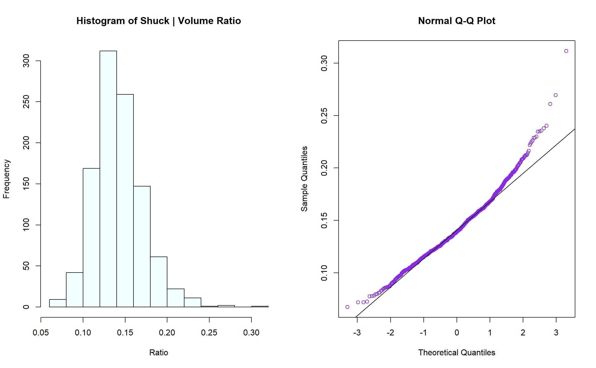
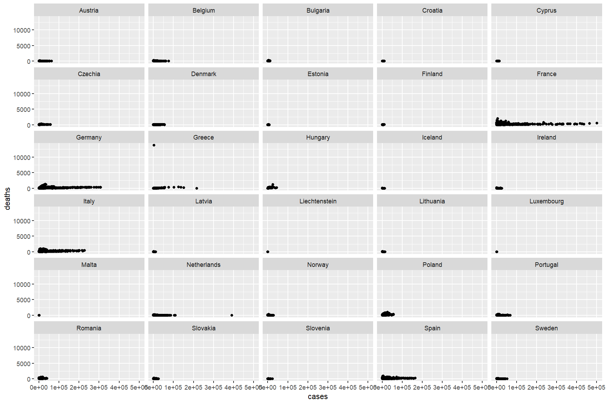
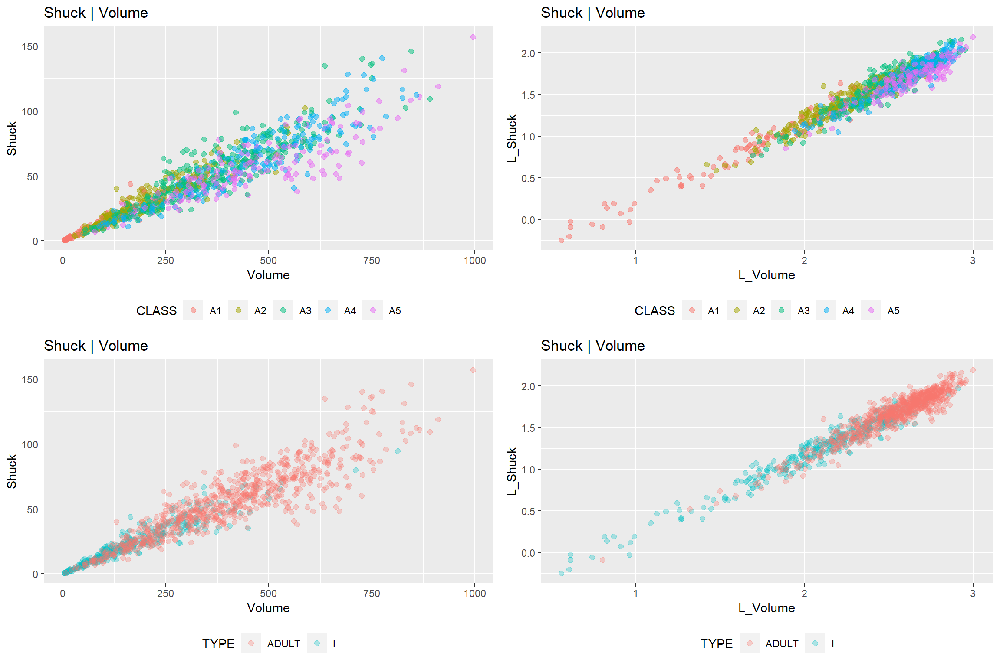
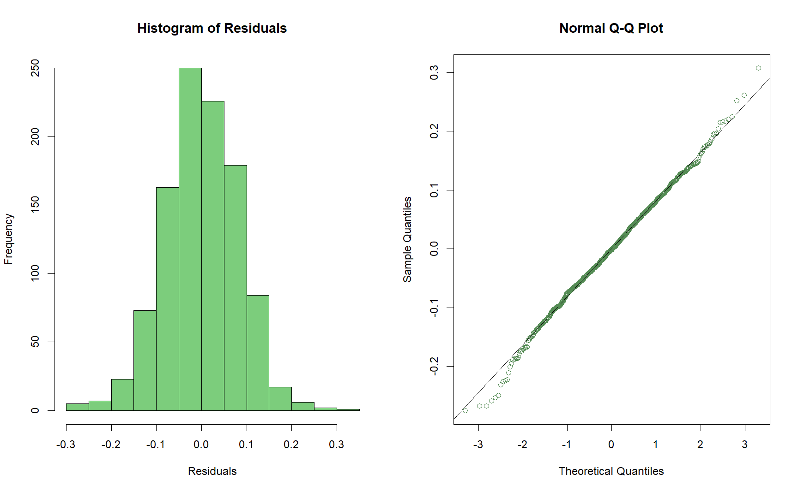
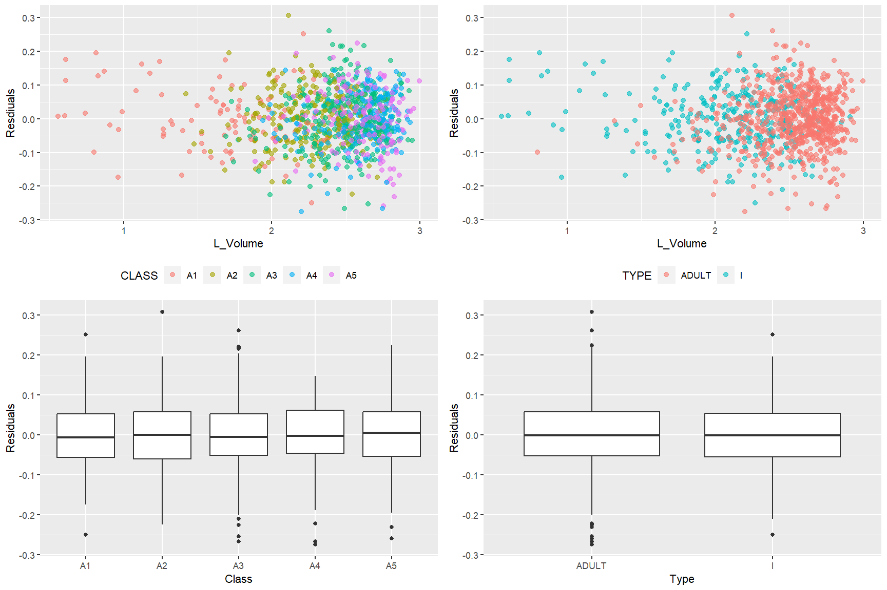
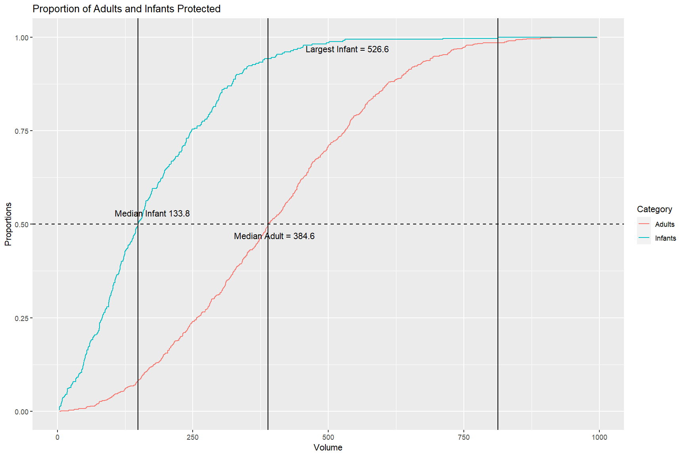
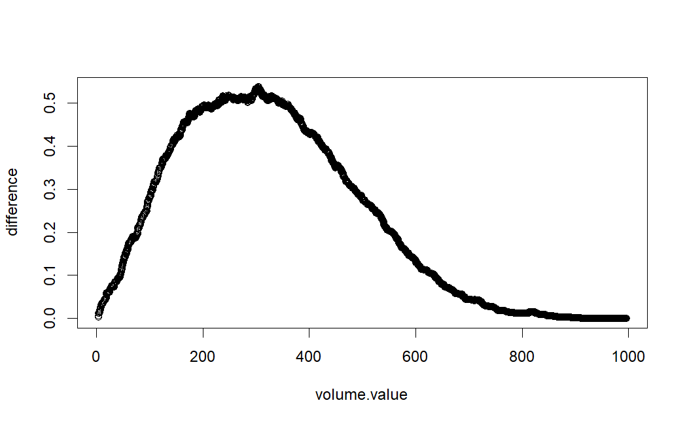
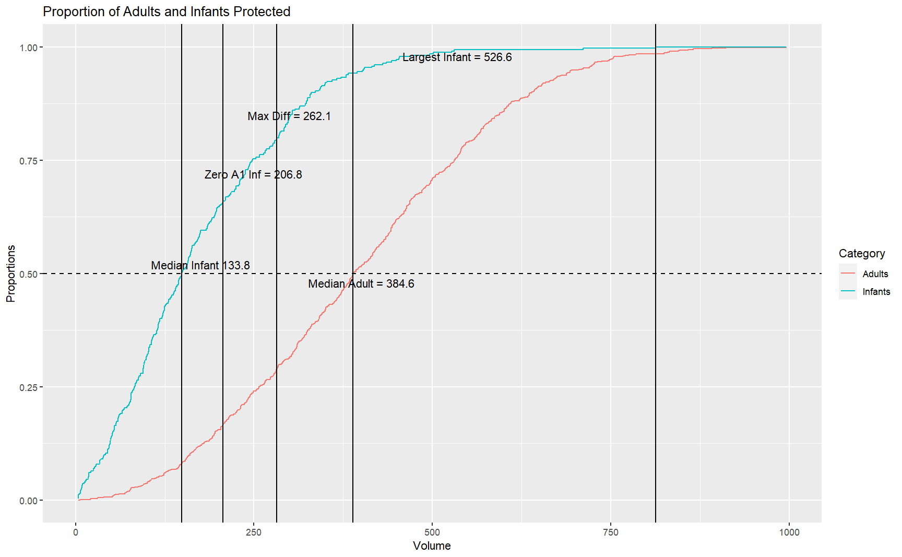
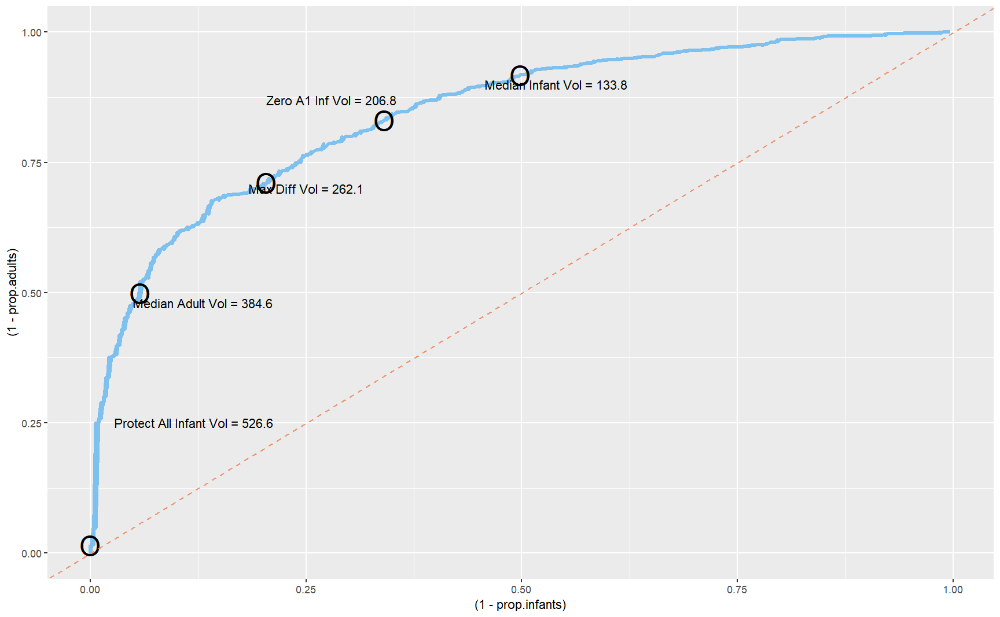

### Program Setup

```
# Perform the following steps to start the assignment.
 
# 1) Load/attach the following packages via library():  flux, ggplot2, gridExtra, moments, rockchalk, car.
# NOTE:  packages must be installed via install.packages() before they can be loaded.

library(dplyr)
library(flux)
library(ggplot2)
library(gridExtra)
library(knitr)
library(kableExtra)
library(rockchalk)
library(tidyverse)

# 2) Use the "mydata.csv" file from Assignment #1 or use the file posted on the course site.  Reading
# the files into R will require sep = "" or sep = " " to format data properly.  Use str() to check file
# structure.

mydata <- read.csv("mydata.csv", sep = ",", stringsAsFactors = TRUE)
# mydata <- read.csv(file.path("c:...", "mydata.csv"), sep = ",")
# mydata <- read.csv(file.path("c:/Rabalone/", "mydata.csv"), sep = ",")

str(mydata)
```

### EDA

**1a.** Form a histogram and QQ plot using RATIO. Calculate skewness and kurtosis using 'rockchalk.' Be aware that with 'rockchalk', the kurtosis value has 3.0 subtracted from it which differs from the 'moments' package.

```
par(mfrow = c(1, 2))

hist(mydata$RATIO, col = "azure1", main = "Histogram of Shuck | Volume Ratio", xlab = "Ratio")
qqnorm(y = mydata$RATIO, col = "blueviolet")
qqline(y = mydata$RATIO, datax = FALSE, distribution = qnorm)

rockchalk::skewness(mydata$RATIO)
rockchalk::kurtosis(mydata$RATIO)

par(mfrow = c(1, 1))
```


skewness: 0.7147056  
kurtosis: 1.667298

**1b.** Tranform RATIO using *log10()* to create L_RATIO (Kabacoff Section 8.5.2, p. 199-200). Form a histogram and QQ plot using L_RATIO. Calculate the skewness and kurtosis. Create a boxplot of L_RATIO differentiated by CLASS  

```
par(cex = 2.5)
mydata$L_RATIO <- log10(mydata$RATIO)

plots <- matrix(c(1, 2, 3, 3), ncol = 2, byrow = TRUE)
layout(plots)
hist(mydata$L_RATIO, main = "Historgram of Log Transformed Ratio", col = "azure1", xlab = "L_Ratio")
qqnorm(y = mydata$L_RATIO, col = "blueviolet")
qqline(y = mydata$L_RATIO, datax = FALSE, distribution = qnorm)

boxplot(L_RATIO ~ CLASS, data = mydata, col = "lightblue3")

rockchalk::skewness(mydata$L_RATIO)
rockchalk::kurtosis(mydata$L_RATIO)


par(mfrow = c(1, 1))
```


skewness: -0.09391548
kurtosis: 0.5354309

**1c.** Test the homogeneity of variance across classes.

```
bartlett.test(RATIO ~ CLASS, data = mydata)
bartlett.test(L_RATIO ~ CLASS, data = mydata)
```
**OUTPUT**

Bartlett test of homogeneity of variances  

data:  RATIO by CLASS  
Bartlett's K-squared = 21.49, df = 4, p-value = 0.0002531  


Bartlett test of homogeneity of variances  

data:  L_RATIO by CLASS  
Bartlett's K-squared = 3.1891, df = 4, p-value = 0.5267  


**Summary:** L-Ratio exhibits better conformance to the normal distribution. Comparing the two visually this is apparent but then it is further supported with the QQ plot of the L_Ratio having a better fit to the curve, suggesting a more normal distribution. Examining the skewness from the rockchalk output shows a smaller value for the L_ratio distribution. This is supported, again, by visually inspecting the Ratio curve where it displays a right skew. Lastly the Bartletts test produces a p-value for the L_Ratio distribution that is statistically insignificant suggesting that the variances among the classes are equal, which is supported by the boxplot outputs.

**2a.** Perform an analysis of variance with *aov()* on L_RATIO using CLASS and SEX as the independent variables. Perform two analyses. First, fit a model with the interaction term CLASS:SEX. Then, fit a model without CLASS:SEX. Use *summary()* to obtain the analysis of variance tables.

```
interact <- aov(L_RATIO ~ CLASS*SEX, data = mydata)
summary(interact)

no_interact <- aov(L_RATIO ~ CLASS + SEX, data = mydata)
summary(no_interact)
```

|            | Df | Sum Sq | Mean Sq | F value | Pr(>F) |
|------------|----|--------|---------|---------|--------|
| CLASS      |  4 |  1.055 |  0.26384|  38.370 | < 2e-16 *** |
| SEX        |  2 |  0.091 |  0.04569|   6.644 | 0.00136 **  |
| CLASS:SEX  |  8 |  0.027 |  0.00334|   0.485 | 0.86709    |
| Residuals  |1021|  7.021 |  0.00688|         |            |
|------------|----|--------|---------|---------|------------|
Signif. codes: 0 ‘***’ 0.001 ‘**’ 0.01 ‘*’ 0.05 ‘.’ 0.1 ‘ ’ 1

|            | Df | Sum Sq | Mean Sq | F value | Pr(>F) |
|------------|----|--------|---------|---------|--------|
| CLASS      |  4 |  1.055 |  0.26384|  38.524 | < 2e-16 *** |
| SEX        |  2 |  0.091 |  0.04569|   6.671 | 0.00132 **  |
| Residuals  |1029|  7.047 |  0.00685|         |            |
|------------|----|--------|---------|---------|------------|
Signif. codes: 0 ‘***’ 0.001 ‘**’ 0.01 ‘*’ 0.05 ‘.’ 0.1 ‘ ’ 1


**Summary:** In both analysis there are main effects of class and sex; the class of abalone significantly affects the L_ratio and the sex significantly affects the L_ratio. The non-significant interaction suggests that the two IV's, class and sex, do not interact to predict L_ratios. The way class affects L_ratios does not differ based on sex.

**2b.** For the model without CLASS:SEX (i.e. an interaction term), obtain multiple comparisons with the *TukeyHSD()* function. Interpret the results at the 95% confidence level (*TukeyHSD()* will adjust for unequal sample sizes).

```
TukeyHSD(no_interact, conf.level=0.95)
```
Tukey multiple comparisons of means  
95% family-wise confidence level  

Fit: aov(formula = L_RATIO ~ CLASS + SEX, data = mydata)  

**Class**
|       |   diff   |   lwr    |   upr    |  p adj   |
|-------|----------|----------|----------|----------|
| A2-A1 | -0.0125  | -0.0388  |  0.0138  | 0.6919   |
| A3-A1 | -0.0343  | -0.0593  | -0.00918 | 0.00186  |
| A4-A1 | -0.0586  | -0.0859  | -0.0313  | 1.0e-7   |
| A5-A1 | -0.100   | -0.1276  | -0.0723  | 0.0      |
| A3-A2 | -0.0218  | -0.0411  | -0.00248 | 0.0178   |
| A4-A2 | -0.0461  | -0.0683  | -0.024   | 2.0e-7   |
| A5-A2 | -0.0875  | -0.110   | -0.0649  | 0.0      |
| A4-A3 | -0.0244  | -0.0451  | -0.0037  | 0.0115   |
| A5-A3 | -0.0657  | -0.0869  | -0.0446  | 0.0      |
| A5-A4 | -0.0413  | -0.0651  | -0.0176  | 0.000022 |

**Sex**
|      |   diff   |   lwr    |   upr    |  p adj   |
|------|----------|----------|----------|----------|
| I-F  | -0.0159  | -0.0311  | -0.000711| 0.0377   |
| M-F  |  0.00207 | -0.0126  |  0.0167  | 0.9413   |
| M-I  |  0.01796 |  0.00334 |  0.0326  | 0.0112   |


**Summary:** Based on the TukeyHSD analysis there is no significant difference when comparing the L-ratio of A1-A2 age classes. Each of the other age classes are different from each other. This indicates that L_Ratio is acceptable to use as a dependent variable and that their generally is a significant difference in L_ratio across age class. The results of the Tukey analyses demonstrate that male and female levels are not different, suggesting that they can be combined into one group.

**3a.** Combine "M" and "F" into a new level. Present side-by-side histograms of VOLUME. One should display infant volumes and, the other, adult volumes.

```
mydata$TYPE <- factor(ifelse(mydata$SEX == "I", "I", "ADULT"))
table(mydata$TYPE)

ggplot(data = mydata, aes(x = VOLUME)) +
  geom_histogram() +
  facet_grid(. ~ TYPE)
```

| ADULT |   I   |
|-------|-------| 
|  707  |  329  |  




**Summary:** When comparing the histograms, the infant histogram is skewed right, while the adult histogram looks much closer to a normal distribution. Due to the infant histogram skewness, it will be difficult to separate infant and adult abalones in the volume range of 0 to 500.

**3b.** Create a scatterplot of SHUCK versus VOLUME and a scatterplot of their base ten logarithms, labeling the variables as L_SHUCK and L_VOLUME. Please be aware the variables, L_SHUCK and L_VOLUME, present the data as orders of magnitude (i.e. VOLUME = 100 = 10^2 becomes L_VOLUME = 2). Use color to differentiate CLASS in the plots. Repeat using color to differentiate by TYPE.

```
mydata$L_VOLUME <- log10(mydata$VOLUME)
mydata$L_SHUCK <- log10(mydata$SHUCK)

grid.arrange(
  ggplot(data=mydata, aes(VOLUME, SHUCK))+
    geom_point(aes(colour = CLASS), size = 2, alpha = 0.5)+
    labs(title = "Shuck | Volume", x="Volume", y= "Shuck")+
    theme(legend.position = "bottom"),
  
  ggplot(data=mydata, aes(L_VOLUME, L_SHUCK))+
    geom_point(aes(colour = CLASS), size = 2, alpha = 0.5)+
    labs(title = "Shuck | Volume", x="L_Volume", y= "L_Shuck")+
    theme(legend.position = "bottom"),
  
  ggplot(data=mydata, aes(VOLUME, SHUCK))+
    geom_point(aes(colour = TYPE), size = 2, alpha = 0.3)+
    labs(title = "Shuck | Volume", x="Volume", y= "Shuck")+
    theme(legend.position = "bottom"),

  
  ggplot(data=mydata,  aes(L_VOLUME, L_SHUCK))+
    geom_point(aes(colour = TYPE), size = 2, alpha = 0.3)+
    labs(title = "Shuck | Volume", x="L_Volume", y= "L_Shuck")+
    theme(legend.position = "bottom"),
  nrow=2)

```

  


**Summary:** When comparing the two plots side-by-side the log-transformed plots reduces variability. The implications for linear regression suggest that the log-transformed data is preferred for that analysis. In the plots comparing CLASS, the A1 class is near the origin in both plots. As you move away from the origin the remaining classes are highly clustered in the log-transformed plot, whereas they become much more dispersed in the original plot. The original plot shows clustering of infants at the origin and an increasing amount of adults as you move away, although they become dispersed. In the log-transformed plot we see a similar displays as the CLASS plot. Highly clustered adults far away from the origin with a small proportion of infants present in that cluster.

**4a.** Since abalone growth slows after class A3, infants in classes A4 and A5 are considered mature and candidates for harvest. You are given code in (4)(a1) to reclassify the infants in classes A4 and A5 as ADULTS.

```
mydata$TYPE[mydata$CLASS == "A4" | mydata$CLASS == "A5"] <- "ADULT"
table(mydata$TYPE)
```

**4b.** Regress L_SHUCK as the dependent variable on L_VOLUME, CLASS and TYPE (Kabacoff Section 8.2.4, p. 178-186, the Data Analysis Video #2 and Black Section 14.2). Use the multiple regression model: L_SHUCK ~ L_VOLUME + CLASS + TYPE. Apply *summary()* to the model object to produce results.

```
mod1 <- lm(L_SHUCK ~ L_VOLUME + CLASS + TYPE, data = mydata)
summary(mod1)
```

**OUTPUT**
Call:
lm(formula = L_SHUCK ~ L_VOLUME + CLASS + TYPE, data = mydata)

|       |   Min    |   1Q    |  Median  |   3Q    |   Max   |
|-------|----------|---------|----------|---------|---------|
| Residuals | -0.27483 | -0.0542 | -0.00122 |  0.0557 | 0.30728 |  


Coefficients  
|            |  Estimate  | Std. Error |  t value | Pr(>|t|) |
|------------|------------|------------|----------|----------|
| (Intercept)|  -0.787467 |   0.021601 |  -36.455 | < 2e-16 *** |
| L_VOLUME   |   0.995815 |   0.010329 |   96.411 | < 2e-16 *** |
| CLASSA2    |  -0.017146 |   0.010955 |   -1.565 | 0.117847   |
| CLASSA3    |  -0.046812 |   0.012277 |   -3.813 | 0.000145 *** |
| CLASSA4    |  -0.072866 |   0.013602 |   -5.357 | 1.04e-07 *** |
| CLASSA5    |  -0.114294 |   0.013682 |   -8.354 | < 2e-16 *** |
| TYPEI      |  -0.024634 |   0.006824 |   -3.610 | 0.000321 *** |

Residual standard error: 0.08275 on 1029 degrees of freedom  
Multiple R-squared:  0.9507,	Adjusted R-squared:  0.9504  
F-statistic:  3305 on 6 and 1029 DF,  p-value: < 2.2e-16  

**Summary:** Increases in volume are predictive of similar increases in shuck according to the model. There is a negative relationship between the predictor variables, Class, and the response variable, L_Shuck. That is, a negative coefficient on the CLASS variables indicate that as they increase, the value of the L_Shuck decreases, with all other variables being held constant. The pattern shows that the coefficients tend to decrease as you move up in age class meaning that they account for differences, which is confirmed in the upper right plot above (L_shuck/L_Volume by Class).

TYPE is an important predictor according to this model. The coefficient is negative suggesting that the infant type tends to have a lower L_Shuck than the adult type when all other variables are held constant. This is supported by the lower right plot above where this can be seen (L_Shuck/L_Volume by Type).

**5a.** If "model" is the regression object, use model$residuals and construct a histogram and QQ plot. Compute the skewness and kurtosis. Be aware that with 'rockchalk,' the kurtosis value has 3.0 subtracted from it which differs from the 'moments' package. 

```
par(mfrow = c(1, 2))

hist(mod1$residuals, main = "Histogram of Residuals", xlab = "Residuals", col = "palegreen3")
qqnorm(y = mod1$residuals, col = "palegreen4")
qqline(y = mod1$residuals, datax = FALSE, distribution = qnorm)

rockchalk::skewness(mod1$residuals)
rockchalk::kurtosis(mod1$residuals)

par(mfrow = c(1, 1))
```



skewness: -0.06958434  
kurtosis: 0.3519111

**5b.** Plot the residuals versus L_VOLUME, coloring the data points by CLASS and, a second time, coloring the data points by TYPE. Keep in mind the y-axis and x-axis may be disproportionate which will amplify the variability in the residuals. Present boxplots of the residuals differentiated by CLASS and TYPE. Test the homogeneity of variance of the residuals across classes.

**OUTPUT**
```
grid.arrange(
  
  ggplot(data = mydata, aes(L_VOLUME, mod1$residuals))+
    geom_point(aes(colour = CLASS), size = 2, alpha = 0.6)+
    labs(x="L_Volume", y= "Resdiuals")+
    theme(legend.position = "bottom"),

  ggplot(data = mydata,  aes(L_VOLUME, mod1$residuals))+
    geom_point(aes(colour = TYPE), size = 2, alpha = 0.6)+
    labs(x="L_Volume", y= "Residuals")+
    theme(legend.position = "bottom"),
  
  ggplot(data = mydata, aes(x = CLASS, y = mod1$residuals))+
    geom_boxplot() +
    labs(x="Class", y= "Residuals"),
  
  ggplot(data = mydata, aes(x = TYPE, y = mod1$residuals))+
    geom_boxplot() +
    labs(x="Type", y= "Residuals"),

  nrow=2)

bartlett.test(mod1$residuals ~ CLASS, data = mydata)
```



**Bartlett test of homogeneity of variances**

data:  mod1$residuals by CLASS  
Bartlett's K-squared = 3.792, df = 4, p-value = 0.4349

**Summary:** To determine if the model is a good fit we need to test the assumptions of the regression model. A normally distributed plot of the residuals is one indicator of fit. When looking at the histogram, this looks to be satisfied. The QQ plot confirms this by the majority of points falling on the curve. Skewnses and kurtosis calculations are further proof that their is minimal skewness supporting normal distribution. The typical kurtosis calculation suggests normal distribution if the output if 3. Since the rockchalk package subtracts 3 in the calculation, the output given, that is close to zero, supports the normal distribution assumption. Next it is necessary to determine if the error terms have constant variances and are independent. This assumption is satisfied because the scatter plots of the residuals show no pattern or heteroscedasticity. This is supported with the Bartlett test showing no statistical significance, or difference in the variances of residuals by class. This suggests homoscedasticity, and satisifing the assumption of normality. Due to these assumptions being satisfied and a model with good fit, this indicates that VOLUME may be a useful harvesting decisions.

**Harvest Strategy:**

There is a trade off faced in managing abalone harvest. The infant population must be protected since it represents future harvests. On the other hand, the harvest should be designed to be efficient with a yield to justify the effort. This assignment will use VOLUME to form binary decision rules to guide harvesting. If VOLUME is below a "cutoff" (i.e. a specified volume), that individual will not be harvested. If above, it will be harvested. Different rules are possible.The Management needs to make a decision to implement 1 rule that meets the business goal.

The next steps in the assignment will require consideration of the proportions of infants and adults harvested at different cutoffs. For this, similar "for-loops" will be used to compute the harvest proportions. These loops must use the same values for the constants min.v and delta and use the same statement "for(k in 1:10000)."  Otherwise, the resulting infant and adult proportions cannot be directly compared and plotted as requested.

**6a.** A series of volumes covering the range from minimum to maximum abalone volume will be used in a "for loop" to determine how the harvest proportions change as the "cutoff" changes. Code for doing this is below.

```
idxi <- mydata$TYPE == "I"
idxa <- mydata$TYPE == "ADULT"

max.v <- max(mydata$VOLUME)
min.v <- min(mydata$VOLUME)
delta <- (max.v - min.v)/10000
prop.infants <- numeric(10000)
prop.adults <- numeric(10000)
volume.value <- numeric(10000)

total.infants <- sum(idxi)  
total.adults <- sum(idxa)

for (k in 1:10000) { 
	value <- min.v + k*delta
	volume.value[k] <- value
	prop.infants[k] <- sum(mydata$VOLUME[idxi] <= value)/total.infants
	prop.adults[k] <-  sum(mydata$VOLUME[idxa] <= value)/total.adults
}

```

**6b.** Our first "rule" will be protection of all infants. We want to find a volume cutoff that protects all infants, but gives us the largest possible harvest of adults. We can achieve this by using the volume of the largest infant as our cutoff. You are given code below to identify the largest infant VOLUME and to return the proportion of adults harvested by using this cutoff. You will need to modify this latter code to return the proportion of infants harvested using this cutoff. Remember that we will harvest any individual with VOLUME greater than our cutoff.

```
# Largest infant volume
(max_inf_vol <- max(mydata$VOLUME[mydata$TYPE == "I"]))  # [1] 526.6383

# Proportion of adults harvested
sum(mydata$VOLUME[mydata$TYPE == "ADULT"] > max_inf_vol) /
  total.adults  # [1] 0.2476573

# Add code to calculate the proportion of infants harvested
sum(mydata$VOLUME[mydata$TYPE == "I"] > max_inf_vol) /
  total.infants

# If we use the largest infant volume, we harvest approximately 24.8% of adults and 0%,
# as expected, of infants.
```
**OUTPUT**  
812.4212  
0.0155587  
0

**6c.** Our next approaches will look at what happens when we use the median infant and adult harvest VOLUMEs. Using the median VOLUMEs as our cutoffs will give us (roughly) 50% harvests. We need to identify the median volumes and calculate the resulting infant and adult harvest proportions for both.

```# Add code to determine the median infant volume:
(med_inf_vol <- median(mydata$VOLUME[mydata$TYPE == "I"]))

# Add code to calculate the proportion of infants harvested
sum(mydata$VOLUME[mydata$TYPE == "I"] > med_inf_vol) /
  total.infants

# Add code to calculate the proportion of adults harvested
sum(mydata$VOLUME[mydata$TYPE == "ADULT"] > med_inf_vol) /
  total.adults 

# If we use the median infant volume as our cutoff, we harvest almost 50% of our infants
# and a little more than 93% of our adults.


# Add code to determine the median adult volume:
(med_adult_vol <- median(mydata$VOLUME[mydata$TYPE == "ADULT"]))

# Add code to calculate the proportion of infants harvested
sum(mydata$VOLUME[mydata$TYPE == "I"] > med_adult_vol) /
  total.infants

# Add code to calculate the proportion of adults harvested
sum(mydata$VOLUME[mydata$TYPE == "ADULT"] > med_adult_vol) /
  total.adults 

# If we use the median adult volume as our cutoff, we harvest almost 50% of adults
# and approximately 2.4% of infants.
```

**OUTPUT**  
[1] 148.4515  
[1] 0.4984802  
[1] 0.9179632  
[1] 388.7189  
[1] 0.05775076  
[1] 0.4992928  

**6d.** Create a plot showing the infant conserved proportions (i.e. "not harvested," the prop.infants vector) and the adult conserved proportions (i.e. prop.adults) as functions of volume.value. We will add vertical A-B lines and text annotations for the three (3) "rules" considered, thus far:  "protect all infants," "median infant" and "median adult." Your plot will have two (2) curves - one (1) representing infant and one (1) representing adult proportions as functions of volume.value - and three (3) A-B lines representing the cutoffs determined in (6)(b) and (6)(c).

```
Category = c(rep("Adults", 10000))
cat2 = c(rep("Infants", 10000))         
         

ggplot(mapping = aes(x = volume.value, y = prop.adults, color = Category))+
  geom_line()+
  geom_line(aes(y = prop.infants, color = cat2))+
  geom_hline(yintercept = 0.5, lty = 2)+
  geom_vline(xintercept = c(med_inf_vol, med_adult_vol, max_inf_vol))+
  labs(title = "Proportion of Adults and Infants Protected", x= "Volume", y= "Proportions")+
  annotate("text", x=175, y=0.53, label= "Median Infant 133.8")+
  annotate("text", x=400, y=0.47, label= "Median Adult = 384.6")+
  annotate("text", x=535, y=0.97, label= "Largest Infant = 526.6") 
```



**Summary:** Looking at the median infant cutoff, a majority of the harvest will be adults. However, this will also include half of the infant population. This suggests this is a bad cutoff to use and pose problems for abalone population sustainability. Looking at the median cutoff for adults, this cutoff will still result in infant harvests and primarily adults but only resulting 50% of the adults.

**More harvest strategies:**

This part will address the determination of a cutoff volume.value corresponding to the observed maximum difference in harvest percentages of adults and infants. In other words, we want to find the volume value such that the vertical distance between the infant curve and the adult curve is maximum. To calculate this result, the vectors of proportions from item (6) must be used. These proportions must be converted from "not harvested" to "harvested" proportions by using (1 - prop.infants) for infants, and (1 - prop.adults) for adults. The reason the proportion for infants drops sooner than adults is that infants are maturing and becoming adults with larger volumes.

Note on ROC:

There are multiple packages that have been developed to create ROC curves. However, these packages - and the functions they define - expect to see predicted and observed classification vectors. Then, from those predictions, those functions calculate the true positive rates (TPR) and false positive rates (FPR) and other classification performance metrics. Worthwhile and you will certainly encounter them if you work in R on classification problems.
However, in this case, we already have vectors with the TPRs and FPRs. Our adult harvest proportion vector, (1 - prop.adults), is our TPR. This is the proportion, at each possible 'rule,' at each hypothetical harvest threshold (i.e. element of volume.value), of individuals we will correctly identify as adults and harvest. Our FPR is the infant harvest proportion vector, (1 - prop.infants). We can think of TPR as the Confidence level (ie 1 - Probability of Type I error and FPR as the Probability of Type II error. At each possible harvest threshold, what is the proportion of infants we will mistakenly harvest?
Our ROC curve, then, is created by plotting (1 - prop.adults) as a function of (1 - prop.infants). In short, how much more 'right' we can be (moving upward on the y-axis), if we're willing to be increasingly wrong; i.e. harvest some proportion of infants (moving right on the x-axis)?

**7a.** Evaluate a plot of the difference ((1 - prop.adults) - (1 - prop.infants)) versus volume.value. Compare to the 50% "split" points determined in (6)(a). There is considerable variability present in the peak area of this plot. The observed "peak" difference may not be the best representation of the data. One solution is to smooth the data to determine a more representative estimate of the maximum difference.

```difference <- ((1 - prop.adults) - (1 - prop.infants))
plot(volume.value, difference)
```



**7b.** Execute the following code to create a smoothed curve to append to the plot in (a). The procedure is to individually smooth (1-prop.adults) and (1-prop.infants) before determining an estimate of the maximum difference. 

```
y.loess.a <- loess(1 - prop.adults ~ volume.value, span = 0.25,
	family = c("symmetric"))
y.loess.i <- loess(1 - prop.infants ~ volume.value, span = 0.25,
	family = c("symmetric"))
smooth.difference <- predict(y.loess.a) - predict(y.loess.i)
```

**7c.** Present a plot of the difference ((1 - prop.adults) - (1 - prop.infants)) versus volume.value with the variable smooth.difference superimposed. Determine the volume.value corresponding to the maximum smoothed difference (Hint:  use *which.max()*). Show the estimated peak location corresponding to the cutoff determined.

Include, side-by-side, the plot from (6)(d) but with a fourth vertical A-B line added. That line should intercept the x-axis at the "max difference" volume determined from the smoothed curve here.


```
mx_smooth_dif <- volume.value[which.max(smooth.difference)]

grid.arrange(
  ggplot()+
    geom_point(mapping = aes(x = volume.value, y = difference), color = "lightBlue")+
    geom_line(mapping = aes(x = volume.value, y = smooth.difference), lty = 2, lwd = 2)+
    geom_vline(xintercept = mx_smooth_dif, lwd = 1.5)+
    annotate("text", x=450, y=0.6, size= 6, label = "Volume = 262.14")+
    labs(x = "Volume", y = "Difference in Proportions Harvested"),

  ggplot(mapping = aes(x = volume.value, y = prop.adults, color = Category))+
  geom_line()+
  geom_line(aes(y = prop.infants, color = cat2))+
  geom_hline(yintercept = 0.5, lty = 2)+
  geom_vline(xintercept = c(med_inf_vol, med_adult_vol, max_inf_vol, volume.value[which.max(smooth.difference)]))+
  labs(title = "Proportion of Adults and Infants Protected", x= "Volume", y= "Proportions")+
  annotate("text", x=175, y=0.52, label= "Median Infant 133.8")+
  annotate("text", x=400, y=0.48, label= "Median Adult = 384.6")+
  annotate("text", x=535, y=0.97, label= "Largest Infant = 526.6")+
  annotate("text", x=250, y=0.85, label= "Max Diff = 262.1"),
  
  ncol = 2)
```

**7d.** What separate harvest proportions for infants and adults would result if this cutoff is used? Show the separate harvest proportions. We will actually calculate these proportions in two ways:  first, by 'indexing' and returning the appropriate element of the (1 - prop.adults) and (1 - prop.infants) vectors, and second, by simply counting the number of adults and infants with VOLUME greater than the volume threshold of interest.

```
(1 - prop.adults)[which.max(smooth.difference)]  # [1] 0.7416332
# OR,
#sum(mydata[mydata$TYPE == "ADULT", "VOLUME"] >
#      volume.value[which.max(smooth.difference)]) / total.adults # [1] 0.7416332

(1 - prop.infants)[which.max(smooth.difference)]
```
**OUTPUT**  
[1] 0.7114569  
[1] 0.2036474

**8a.** Harvesting of infants in CLASS "A1" must be minimized. The smallest volume.value cutoff that produces a zero harvest of infants from CLASS "A1" may be used as a baseline for comparison with larger cutoffs. Any smaller cutoff would result in harvesting infants from CLASS "A1."  

Compute this cutoff, and the proportions of infants and adults with VOLUME exceeding this cutoff. Code for determining this cutoff is provided. Show these proportions. You may use either the 'indexing' or 'count' approach, or both.

```
cutoff <- volume.value[volume.value > max(mydata[mydata$CLASS == "A1" &
  mydata$TYPE == "I", "VOLUME"])][1] # [1] 206.786
cutoff

sum(mydata$VOLUME[mydata$TYPE == "I"] > cutoff) /
  total.infants

sum(mydata$VOLUME[mydata$TYPE == "ADULT"] > cutoff) /
  total.adults
```

**OUTPUT**  
[1] 206.786  
[1] 0.3404255  
[1] 0.8316832  

**8b.** Append one (1) more vertical A-B line to our (6)(d) graph. This time, showing the "zero A1 infants" cutoff from (8)(a). This graph should now have five (5) A-B lines:  "protect all infants," "median infant," "median adult," "max difference" and "zero A1 infants."

```
ggplot(mapping = aes(x = volume.value, y = prop.adults, color = Category))+
  geom_line()+
  geom_line(aes(y = prop.infants, color = cat2))+
  geom_hline(yintercept = 0.5, lty = 2)+
  geom_vline(xintercept = c(med_inf_vol, med_adult_vol, max_inf_vol, volume.value[which.max(smooth.difference)], cutoff))+
  labs(title = "Proportion of Adults and Infants Protected", x= "Volume", y= "Proportions")+
  annotate("text", x=175, y=0.52, label= "Median Infant 133.8")+
  annotate("text", x=400, y=0.48, label= "Median Adult = 384.6")+
  annotate("text", x=535, y=0.98, label= "Largest Infant = 526.6")+
  annotate("text", x=300, y=0.85, label= "Max Diff = 262.1")+
  annotate("text", x=250, y=0.72, label= "Zero A1 Inf = 206.8")
```



**9a.** Construct an ROC curve by plotting (1 - prop.adults) versus (1 - prop.infants). Each point which appears corresponds to a particular volume.value. Show the location of the cutoffs determined in (6), (7) and (8) on this plot and label each.

```
ggplot()+
  geom_line(mapping = aes(x = (1 - prop.infants), y = (1 - prop.adults)), color = "skyblue2", lwd = 1.5)+
  geom_point(mapping = aes(x = 0, y = sum(mydata$VOLUME[mydata$TYPE == "ADULT"] > max_inf_vol) /
  total.adults), pch = "O", size = 8)+
  geom_point(mapping = aes(x = sum(mydata$VOLUME[mydata$TYPE == "I"] > med_adult_vol) /
  total.infants, y = sum(mydata$VOLUME[mydata$TYPE == "ADULT"] > med_adult_vol) /
  total.adults), pch = "O", size = 8)+
  geom_point(mapping = aes(x = (1 - prop.infants)[which.max(smooth.difference)], y = sum(mydata[mydata$TYPE == "ADULT", "VOLUME"] >
      volume.value[which.max(smooth.difference)]) / total.adults), pch = "O", size = 8)+
  geom_point(mapping = aes(x = sum(mydata$VOLUME[mydata$TYPE == "I"] > cutoff) /
  total.infants, y = sum(mydata$VOLUME[mydata$TYPE == "ADULT"] > cutoff) /
  total.adults), pch = "O", size = 8)+
  geom_point(mapping = aes(x = sum(mydata$VOLUME[mydata$TYPE == "I"] > med_inf_vol) /
  total.infants, y = sum(mydata$VOLUME[mydata$TYPE == "ADULT"] > med_inf_vol) /
  total.adults 
), pch = "O", size = 8)+
  geom_abline(intercept = 0, slope = 1, lty = 2, color = "lightsalmon2")+
  annotate("text", x=0.54, y=0.9, label= "Median Infant Vol = 133.8")+
  annotate("text", x=0.13, y=0.48, label= "Median Adult Vol = 384.6")+
  annotate("text", x=0.12, y=0.25, label= "Protect All Infant Vol = 526.6")+
  annotate("text", x=0.28, y=0.87, label= "Zero A1 Inf Vol = 206.8")+
  annotate("text", x=0.25, y=0.70, label= "Max Diff Vol = 262.1")
```



**9b.** Numerically integrate the area under the ROC curve and report your result. This is most easily done with the *auc()* function from the "flux" package.   Areas-under-curve, or AUCs, greater than 0.8 are taken to indicate good discrimination potential.

```
auc(x = (1 - prop.infants), y = (1 - prop.adults))
```

**OUTPUT**
0.8422699

***10a.*** Prepare a table showing each cutoff along with the following:  
 	1) true positive rate (1-prop.adults),  
 	2) false positive rate (1-prop.infants),  
 	3) harvest proportion of the total population

```
#Calc Total Harvest
protect_inf_harv <- round(sum(mydata$VOLUME >
      max_inf_vol) / sum(total.adults, total.infants), digits = 3)

med_inf_harv <- round(sum(mydata$VOLUME >
      med_inf_vol) / sum(total.adults, total.infants), digits = 3)

med_ad_harv <- round(sum(mydata$VOLUME >
      med_adult_vol) / sum(total.adults, total.infants), digits = 3)

max_diff_harv <- round(sum(mydata$VOLUME >
      mx_smooth_dif) / sum(total.adults, total.infants), digits = 3)

zero_A1inf_harv <- round(sum(mydata$VOLUME > cutoff) / sum(total.adults, total.infants), digits = 3)

#Create Row Vectors
protect_inf <- c( max_inf_vol, 
                  sum(mydata$VOLUME[mydata$TYPE == "ADULT"] > max_inf_vol) / total.adults,
                  sum(mydata$VOLUME[mydata$TYPE == "I"] > max_inf_vol) / total.infants,
                  protect_inf_harv)
                 
med_inf <- c( med_inf_vol, 
              sum(mydata$VOLUME[mydata$TYPE == "ADULT"] > med_inf_vol) / total.adults,
              sum(mydata$VOLUME[mydata$TYPE == "I"] > med_inf_vol) / total.infants,
              med_inf_harv)

med_ad <- c( med_adult_vol,
             sum(mydata$VOLUME[mydata$TYPE == "ADULT"] > med_adult_vol) /  total.adults,
             sum(mydata$VOLUME[mydata$TYPE == "I"] > med_adult_vol) /  total.infants,
             med_ad_harv)

max_diff <- c( mx_smooth_dif,
               (1 - prop.adults)[which.max(smooth.difference)],
               (1 - prop.infants)[which.max(smooth.difference)],
               max_diff_harv)

zero_A1inf <- c( cutoff,
                 sum(mydata$VOLUME[mydata$TYPE == "ADULT"] > cutoff) /  total.adults,
                 sum(mydata$VOLUME[mydata$TYPE == "ADULT"] > cutoff) /  total.adults,
                 zero_A1inf_harv)


#Bind Rows with Row Labels
myTable <- rbind(protect_inf, med_inf, med_ad, max_diff, zero_A1inf)
row.names(myTable)[row.names(myTable) == c("protect_inf", "med_inf", "med_ad", "max_diff", "zero_A1inf")] <- c("Protect All Infants", "Median Infants", "Median Adults", "Max Difference", "Zero A1 Infants")  

#Compile Data Table

table <- kable(myTable, digits = c(1, 3, 3, 3), col.names = c("Volume", "TPR", "FPR", "Total Harvest"), align = c("l" , "c", "c", "c", "c"))
kable_styling(table, full_width = TRUE, 
                        bootstrap_options = c("striped", "hover"),
                        fixed_thead = TRUE,
                        position = "float_left",
                        font_size = 14)
```


|                | Volume |   TPR  |   FPR  | Total Harvest |
|----------------|--------|--------|--------|---------------|
| Protect All Infants |  812.4 | 0.016  | 0.000  | 0.011         |
| Median Infants      |  148.5 | 0.918  | 0.498  | 0.785         |
| Median Adults       |  388.7 | 0.499  | 0.058  | 0.359         |
| Max Difference      |  262.1 | 0.711  | 0.204  | 0.584         |
| Zero A1 Infants     |  206.8 | 0.832  | 0.832  | 0.676         |


**Summary:**  Starting at the extreme which is "Protect all infants" we see that all infants are not harvested, but only 25% of adults are harvested. On the other extreme on the ROC curve, "Median Infants", we see that a very large proportion of adults are harvested, 93%, but also 50% of infants. This is not ideal for a sustainable abalone population if 50% are prematurely harvested. Next, "Median Adult", shows a very small, about 2%, of infants being harvest and about 25% of adults. Although very few infants will die, this small proportion of adults suggests that the harvester may not make profits in a meaningful way. Next, the "Max Difference" cutoff shows a more promising cutoff. Here, there are nearly 75% of adults being harvested and less than 20% of infants being harvested. The Last cutoff, "Zero A1 Infants", has no infants of the smallest class A1, a large proportion of adults, at almost 83%, and just shy of 30% of infants harvested. Lastly the area under the curve is greater than 0.8 which is ideal and indicates good discrimination potential.

### Conclusion:

I would recommend the harvesters focus on the two cutoff areas of "Max Difference" and "Zero A1 Infants". At the "Max Difference" cutoff, 74% of adults will be harvested with only 17% of infants with the total harvest at almost 60%. At the "Zero A1 Infants" cutoff, 83% of adults will be harvested and 29% of infants with total yield at roughly 68%. These two cutoffs are where they should focus if they want to have a sustainable abalone population by not harvesting too many infants, but also harvesting enough abalones to see a meaningful profit for their efforts. The data points to using the "Median Infants" cutoff for overall maximum yield, however half of the infants will be harvested at this cutoff which is not sustainable long term for the species. If the harvester uses the "Protect All Infants" cutoff, no infants will die, but the overall yield would be below 20%, and a similar argument can be made for the "Median Adults" cutoff. The trade off is that infants will be harvested using the first two recommended cutoffs. If the harvesters are not comfortable with possibly harvesting the very young, I would recommend using only the "Zero A1 Infant" cutoff. However, the "Max Difference" would produce an overall smaller proportion of infants harvested in comparison, but this cutoff may yield the harvesting of the A1 age class on occasion. Using the "Zero A1 Infant" cutoff insures no very young abalones are harvested, and a greater overall harvest. This analysis does come with limitations. The data presented in the adult category consists of both male and female abalones. The harvester should be alerted to this if abalone reproduction is of concern and more females are needed. Also, this dataset comes from Tasmanina, therefore the conclusions of this study hold true to that location of harvesting, but may vary at different locations. Follow up studies of this type would be necessary at different locations. It would be of interest to determine growth at various sites around the world with varying water temperatures, pollution and food sources. Longitudinal studies may also be necessary especially if the harvester decides to use the "Zero A1 Infant" cutoff. Doing so would help the investigators determine if this cutoff is appropriate for the species sustainability given that a larger proportion of infants will be harvested compared to the Max Difference cut off. Another interesting study could be done where more age classes are used, say increase to 12 classes as an example, in attempt at a more precise estimate on abalone age.