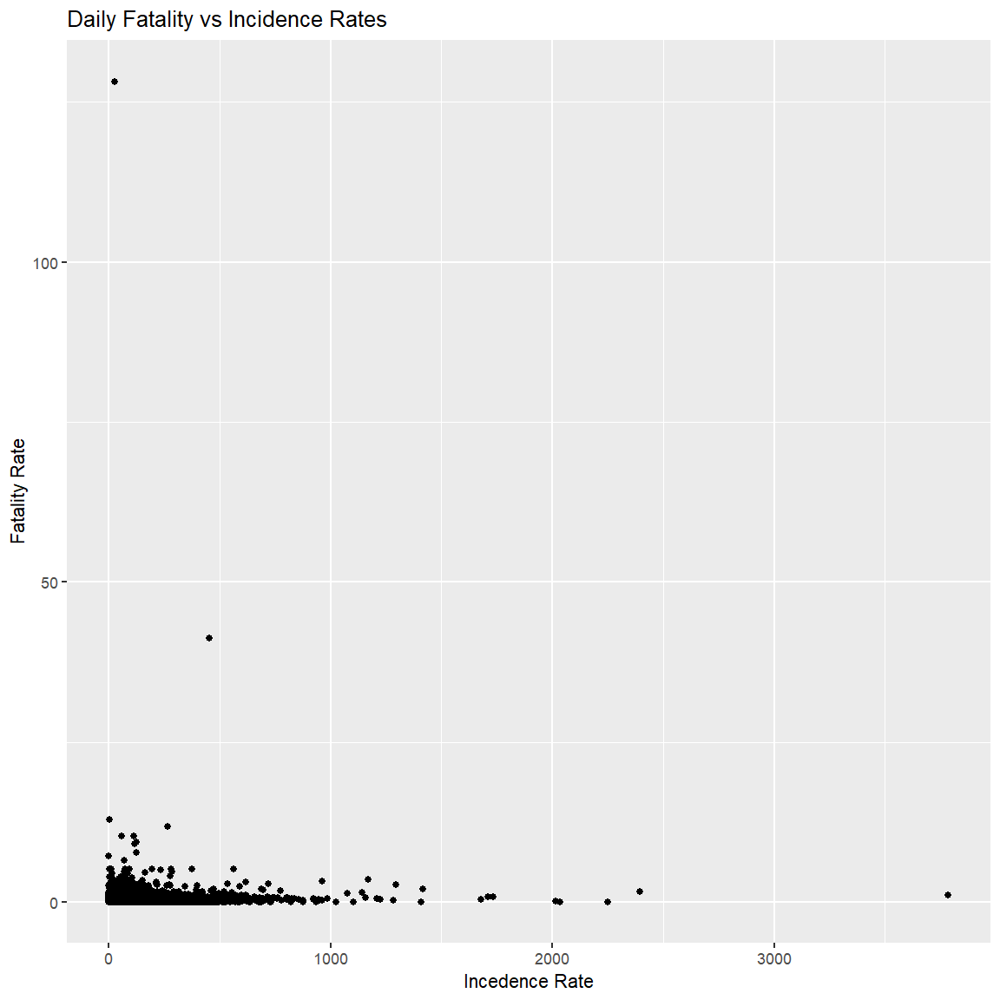

### Description:  
Data was analysized for new daily covid-19 cases and deaths in the European Union (EU) and European Economic Area (EEA) countries (https://www.ecdc.europa.eu/en/publications-data/data-daily-new-cases-covid-19-eueea-country). (1) Performed an Exploratory Data Analysis (EDA), (2) Performed some hypothesis testing, (3) perform some correlation testing, and (4) fit and described a linear regression model.

#### Definitions:

* "Incidence rate" is equal to new daily cases per 100K individuals. Country population estimates can be found in 'popData2020.' You will calculate a daily incidence rate in item (1), for each country, that we will explore further in items (2) and (3).

* "Fatality rate" is equal to new daily deaths per 100K individuals. Country population estimates can be found in 'popData2020.' You will calculate a daily fatality rate in item (1), for each country, that we will explore further in items (2) and (3).

```
library(ggplot2)
library(gridExtra)
library(lubridate)
library(tidyverse)
library(dplyr)
library(Hmisc)
library(knitr)

# The read.csv() below reads the data directly from the web. 
data <- read.csv("https://opendata.ecdc.europa.eu/covid19/nationalcasedeath_eueea_daily_ei/csv",
                 na.strings = "", fileEncoding = "UTF-8-BOM")

# The zero-th step in any analysis is to 'sanity check' our data. Here, we call
# glimpse() from the 'dplyr' package, but utils::str() would work, as well.

glimpse(data)

# The last thing we're going to do is drop the 'continentExp' vector (as all
# observations are "Europe"), coerce the 'dateRep' vector to a date format, and
# coerce the country and territory vectors to factors.

data <- data %>%
  select(-c("continentExp")) %>%
  mutate(dateRep = dmy(dateRep),
         countriesAndTerritories = as.factor(countriesAndTerritories),
         geoId = as.factor(geoId),
         countryterritoryCode = as.factor(countryterritoryCode))
```

#### 1. Descriptive Statistics  
 Perform an Exploratory Data Analysis (EDA). Include the visualizations and summary tables that you find valuable while exploring this dataset. **However**, at minimum, your EDA must include the following:

* Creation of a vector, 'incidence_rate,' equal to the daily new cases per 100K individuals, per country. Country populations are provided in 'popData2020.' This vector should be added to the 'data' data frame.
* Creation of a vector, 'fatality_rate,' equal to the new deaths per 100K individuals, per country. Country populations are provided in 'popData2020.' This vector should be added to the 'data' data frame.
* A visualization exploring new cases or incidence rates, per country, over time. You may choose a subset of countries, if you wish, but your visualization should include at least five (5) countries and include the entire time frame of the dataset.
* A visualization exploring new deaths or fatality rates, per country, over time. You may choose a subset of countries, if you wish, but your visualization should include at least five (5) countries.
* A table or visualization exploring some other aspect of the data. For example, you could explore case fatality rates per country; the number of deaths divided by the total number of cases. Note that to do this, you would want to like across the entire time of the dataset, looking at the total cases and deaths, per country.

```
#head(data)
#summary(data)

#Clean columns after it was discovered that there were negative cases and deaths reported
data <- data[data$cases >= 0 & data$deaths >= 0, ]

#Add vectors to data frame
#incident rate: new cases per 100k people
data$incidence_rate <- (data$cases / data$popData2020) *100000
#fatality rate: deaths per 100k people
data$fatality_rate <- (data$deaths / data$popData2020) *100000

head(data)
summary(data)
str(data)

#exploring new cases, per country, over time
ggplot(data, aes(x = dateRep, y = cases, color = countriesAndTerritories))+
  geom_point(alpha = 0.5)+
  labs(title = "Covid 19 Cases Over Time By Country", x = "Time (2020-01-01 to 2022-10-26)", y = "Cases")

#exploring new deaths per country, over time
ggplot(data, aes(x = dateRep, y = deaths, color = countriesAndTerritories))+
  geom_point(alpha = 0.5)+
  labs(title = "Covid 19 Fatality Over Time By Country", x = "Time (2020-01-01 to 2022-10-26)", y = "Deaths")

#Gain insight into deaths by cases count in each country
data_trim<- na.omit(data)
ggplot(data = data_trim) +
  geom_point(mapping = aes(x = cases, y = deaths)) +
  facet_wrap(. ~ countriesAndTerritories, nrow = 6)

#Identify outliers for fatality rate
death_outliers <- boxplot.stats(data$fatality_rate, coef = 3)$out
outliers <- c(death_outliers)

#Clear unwanted columns for the outliers table
#data_trim <- data %>% select(-geoId, -countryterritoryCode, -day, - month, -year, -popData2020)
#kable(data_trim[data_trim$fatality_rate %in% outliers , ])
#Upon printing the table it was exhaustive and not useful. It will be omitted from the knit file.

#A table and Plot exploring total fatality by total case rates per country:
country_summary <- aggregate(data[c("cases", "deaths", "incidence_rate", "fatality_rate")], by = list(data$countriesAndTerritories), FUN = sum)
colnames(country_summary) <- c("Country", "Total_Cases", "Total_Deaths", "incidence_rate", "fatality_rate")
country_summary

ggplot(data = country_summary) +
  geom_point(mapping = aes(x = Total_Cases, y = Total_Deaths, color = Country), size = 10)+
  labs(title = "Fatalities from Covid-19 | Total Cases in EU", x = "Total Cases", y = "Total Fatalities")
```
**OUTPUT**

Inspect the data:

| dateRep     | day | month | year | cases | deaths | countriesAndTerritories | geoId |
|-------------|-----|-------|------|-------|--------|-------------------------|-------|
| 2022-10-23  |  23 |    10 | 2022 |  3557 |      0 | Austria                 | AT    |
| 2022-10-22  |  22 |    10 | 2022 |  5494 |      4 | Austria                 | AT    |
| 2022-10-21  |  21 |    10 | 2022 |  7776 |      4 | Austria                 | AT    |
| 2022-10-20  |  20 |    10 | 2022 |  8221 |      6 | Austria                 | AT    |
| 2022-10-19  |  19 |    10 | 2022 | 10007 |      8 | Austria                 | AT    |
| 2022-10-18  |  18 |    10 | 2022 | 13204 |      7 | Austria                 | AT    |  

Data Summary:

|         | popData2020 | incidence_rate | fatality_rate |
|---------|-------------|----------------|---------------|
|min      |     38747   |       0.000    |       0.0000  |
|1st Quart|   2095861   |       2.581    |       0.0000  |
|median   |   6951482   |      13.219    |       0.0819  |
|mean     |  15444228   |      42.208    |       0.2703  |
|3rd Quart|  11522440   |      41.011    |       0.3211  |
|max      |  83166711   |    3785.420    |     128.2168  |
|NA's     |       385   |         385    |          385  |  


  

  

  

#### 2. Inferential Statistics
  Select two (2) countries and compare their incidence or fatality rates using hypothesis testing. At minimum, your work should include the following:

* Visualization(s) comparing the daily incidence or fatality rates of the selected countries,
* A statement of the null hypothesis.
* A short justification of the statistical test selected.
    + Why is the test you selected an appropriate one for the comparison we're making?
* A brief discussion of any distributional assumptions of that test.
    + Does the statistical test we selected require assumptions about our data?
    + If so, does our data satisfy those assumptions?
* Your selected alpha.
* The test function output; i.e. the R output.
* The relevant confidence interval, if not returned by the R test output.
* A concluding statement on the outcome of the statistical test.
    + i.e. Based on our selected alpha, do we reject or fail to reject our null hypothesis?


```
# Chose Countries with similar populations:
country_pop <- aggregate(data[c("popData2020")], by = list(data$countriesAndTerritories), FUN = mean)

# Subset 2 Countries: Pop ~ 10.3mil
port <- subset(data, countriesAndTerritories == "Portugal")
swed <- subset(data, countriesAndTerritories == "Sweden")

# Plot histograms with specified bin width
grid.arrange(
  ggplot(port, aes(x = fatality_rate), color = "steelblue") +
  geom_histogram(binwidth = 0.05) +  # Adjust bin width as needed
  labs(title = "Fatality Rates in Portugal From Covid-19", x = "Rates", y = "Frequency"),
  
  ggplot(swed, aes(x = fatality_rate), color = "coral4") +
  geom_histogram(binwidth = 0.05) +  # Adjust bin width as needed
  labs(title = "Fatality Rates in Sweden From Covid-19", x = "Rates", y = "Frequency"),
  ncol = 2)

# Plot fatality rate over time
ggplot() +
  geom_point(data = port, aes(x = dateRep, y = fatality_rate, color = "Portugal"), alpha = 0.75) +
  geom_point(data = swed, aes(x = dateRep, y = fatality_rate, color = "Sweden"), alpha = 0.5) +
  labs(title = "Fatality Rate Over Time", x = "Time", y = "Fatality Rate") +
  scale_color_manual(values = c("Portugal" = "steelblue", "Sweden" = "coral4"))

# Perform t-test
t.test(x = port$fatality_rate, y = swed$fatality_rate,
       alternative = "two.sided",
       mu = 0, paired = FALSE, var.equal = TRUE,
       conf.level = 0.95)
```

  

  

**Two Sample t-test**  

data:  port$fatality_rate and swed$fatality_rate  
t = 3.803, df = 1914, p-value = 0.0001474  
alternative hypothesis: true difference in means is not equal to 0
95 percent confidence interval:
 0.02911434 0.09111864  
sample estimates:  
mean of x, mean of y   
0.2613354, 0.2012189   

**Summary:**  
Null Hypothesis: There is no difference in the average fatality rate between Portugal and Sweden.  

An assumption underlying this technique is that the characteristic, fatality rate, being studied is normally distributed for both populations. This assumption is not satisfied, however because the sample size is so large the central limit theorem states that the sample mean will tend to follow a normal distribution, even if the underlying population is not normally distributed. Also the assumption of equal variances is assumed based on the similar distributions observed from the histograms.  

Reject the null hypothesis that there is no difference in fatality rates between Portugal and Sweden. The result is statistically significant, meaning the likelihood of the difference between the average fatality rates of Portugal and Sweden due to chance is less than 5%. This result is supported from the scatter plot above where we see Portugal having much larger peaks in fatality rates at certain time points compared to Sweden.

#### 3. Correlation
  Considering all countries, explore the relationship between incidence rates and fatality rates. At minimum, your work should include the following:

* Visualization(s) showing the distributions of daily incidence and fatality rates, regardless of country. Please note that both country and date should be disregarded here.
* A short statement identifying the most appropriate correlation coefficient.
    + For the correlation we're interested in, which correlation coefficient is most appropriate?
    + Why do you find the correlation coefficient selected to be the most appropriate?
* The calculated correlation coefficient or coefficient test output; e.g. *cor()* or *cor.test()*.

```
# histograms of daily incidence rates & fatality rates
grid.arrange(
  ggplot(data, aes(x = incidence_rate))+
    geom_histogram(binwidth=30)+
    labs(title = "Histogram of Incidence Rates", x = "Incedence", y = "Count"),
  
  ggplot(data, aes(x = fatality_rate))+
    geom_histogram(binwidth=0.5)+
    labs(title = "Histogram of Fatalitiy Rates", x = "Fatalities", y = "Count"),
  ncol =2
)

ggplot(data = data, aes(x = incidence_rate, y = fatality_rate))+
  geom_point()+
  labs(title = "Daily Fatality vs Incidence Rates", x = "Incedence Rate", y = "Fatality Rate")

corr_co <- cor(x = data$incidence_rate, y = data$fatality_rate, method = "kendall", use = "complete.obs")
cat("Correlation Coefficient:", corr_co)
```

  

  

**Correlation Coefficient:** 0.4202528

**Summary:**  
The Kendall correlation coefficient was chosen because it is a non-parametric measure and does not require the assumption of normality.The histograms shows that the data is skewed right. It is also a robust test when faced with outliers, the EDA showed that the fatality rate has many outliers.

#### 4. Regression
  Fit a model on data from twenty (20) countries considering total new cases as a function of population, population density and gross domestic product (GDP) per capita. Note that the GDP per capita is given in "purchasing power standard," which considers the costs of goods and services in a country relative to incomes in that country; i.e. we will consider this as appropriately standardized.

```
# The code below creates a new data frame, 'model_df,' that includes the area,
# GDP per capita, population and population density for the twenty (20)
# countries of interest. 

twenty_countries <- c("Austria", "Belgium", "Bulgaria", "Cyprus", "Denmark",
                      "Finland", "France", "Germany", "Hungary", "Ireland",
                      "Latvia", "Lithuania", "Malta", "Norway", "Poland",
                      "Portugal", "Romania", "Slovakia", "Spain", "Sweden")

sq_km <- c(83858, 30510, 110994, 9251, 44493, 338145, 551695, 357386, 93030,
           70273, 64589, 65300, 316, 385178, 312685, 88416, 238397, 49036,
           498511, 450295)

gdp_pps <- c(128, 118, 51, 91, 129, 111, 104, 123, 71, 190, 69, 81, 100, 142,
             71, 78, 65, 71, 91, 120)

model_df <- data %>%
  select(c(countriesAndTerritories, popData2020)) %>%
  filter(countriesAndTerritories %in% twenty_countries) %>%
  distinct(countriesAndTerritories, .keep_all = TRUE) %>%
  add_column(sq_km, gdp_pps) %>%
  mutate(pop_dens = popData2020 / sq_km) %>%
  rename(country = countriesAndTerritories, pop = popData2020)
```

Add one (1) more column to our 'model_df' data frame. Specifically, one that has the total number of new cases for each of the twenty (20) countries. We calculate the total number of new cases by summing all the daily new cases, for each country, across all the days in the dataset.

```
total_cases <- data %>%
  select(c(countriesAndTerritories, cases)) %>%
  group_by(countriesAndTerritories) %>%
  dplyr::summarize(total_cases = sum(cases, na.rm = TRUE)) %>%
  filter(countriesAndTerritories %in% twenty_countries) %>%
  select(total_cases)

model_df <- model_df %>%
  add_column(total_cases)
```

Fit the model using the data in 'model_df.' We are interested in explaining total cases (response) as a function of population (explanatory), population density (explanatory), and GDP (explanatory).

At minimum, your modeling work should including the following:

* A description - either narrative or using R output - of your 'model_df' data frame.
    + Consider:  what data types are present? What do our rows and columns represent?
* The *lm()* *summary()* output of your fitted model. As we did in the second Data Analysis Assignment, you can pass your fitted model object - i.e. the output of **lm()** - to *summary()* and get additional details, including R^2, on your model fit.
* A short statement on the fit of the model.
    + Which, if any, of our coefficients are statistically significant?
    + What is the R^2 of our model?
    + Should we consider a reduced model; i.e. one with fewer parameters?

```
#Description of the df:
summary(model_df)
str(model_df)
head(model_df, 20)

# Create lm
mod_1 <- lm(total_cases ~ pop + pop_dens + gdp_pps, data = model_df)
summary(mod_1)
```

| country   | pop       | sq_km   | gdp_pps | pop_dens | total_cases |
|-----------|-----------|---------|---------|----------|-------------|
| Austria   | 8901064   | 83858   | 128     | 106.144  | 5402162     |
| Belgium   | 11522440  | 30510   | 118     | 377.661  | 4597870     |
| Bulgaria  | 6951482   | 110994  | 51      | 62.629   | 1271735     |
| Cyprus    | 888005    | 9251    | 91      | 95.990   | 599500      |
| Denmark   | 5822763   | 44493   | 129     | 130.869  | 3221572     |
| Finland   | 5525292   | 338145  | 111     | 16.340   | 1335318     |
| France    | 67320216  | 551695  | 104     | 122.024  | 36952159    |
| Germany   | 83166711  | 357386  | 123     | 232.708  | 35287690    |
| Hungary   | 9769526   | 93030   | 71      | 105.014  | 2141513     |
| Ireland   | 4964440   | 70273   | 190     | 70.645   | 1675256     |
| Latvia    | 1907675   | 64589   | 69      | 29.536   | 949252      |
| Lithuania | 2794090   | 65300   | 81      | 42.789   | 1266026     |
| Malta     | 514564    | 316     | 100     | 1628.367 | 115285      |
| Norway    | 5367580   | 385178  | 142     | 13.935   | 1454895     |
| Poland    | 37958138  | 312685  | 71      | 121.394  | 6189562     |
| Portugal  | 10295909  | 88416   | 78      | 116.448  | 5514482     |
| Romania   | 19328838  | 238397  | 65      | 81.078   | 3246412     |
| Slovakia  | 5457873   | 49036   | 71      | 111.303  | 2535554     |
| Spain     | 47332614  | 498511  | 91      | 94.948   | 13564823    |
| Sweden    | 10327589  | 450295  | 120     | 22.935   | 2604866     |

Call:
lm(formula = total_cases ~ pop + pop_dens + gdp_pps, data = model_df)  

Residuals:  
| Statistic | Value   |
|-----------|---------|
| Min       | -8290586 |
| 1Q        | -1092896 |
| Median    | -81818   |
| 3Q        | 1657083  |
| Max       | 8955212  |


Coefficients:   
| Predictor   | Estimate   | Std. Error | t value | Pr(>|t|) |
|-------------|------------|------------|---------|----------|
| (Intercept) | -3.875e+06 | 2.787e+06  | -1.390  | 0.183    |
| pop         | 4.285e-01  | 3.676e-02  | 11.658  | 3.13e-09 |
| pop_dens    | 6.502e+02  | 2.432e+03  | 0.267   | 0.793    |
| gdp_pps     | 2.834e+04  | 2.559e+04  | 1.108   | 0.284    |


Residual standard error: 3706000 on 16 degrees of freedom  
Multiple R-squared:  0.8963,	Adjusted R-squared:  0.8769   
F-statistic:  46.1 on 3 and 16 DF,  p-value: 4.251e-08 

**Summary:**  
The population shows to be the only statically significant predictor of total cases. The estimates for population density and GDP predictor variables are not significant, and fail to reject the null hypothesis. Therefore, it is appropriate to drop them for a reduced model with fewer parameters. Additional independent variables are not adding significant information to the model, therefore the adjust R-squared will be of focus, R-sq = 0.8769 . There appears to be a strong relationship between the predictor variable, population, and the response variable, total cases, and can explain 88% of the variation in total cases.

#### 5. Prediction  
use the model to predict total new cases of two (2) countries not included in the model fit. At minimum, your work should include:

* The predicted total new cases for both countries.
* The actual total new cases for both countries.
* A short statement on the performance of the model in these two (2) cases.
    + Compare the new predictions to those made on the fitted dataset. You may compare the predicted values or the residuals.

```
# The code below defines our 'newdata' data frame for applying our model to the
# population, population density and GDP per capita for two (2). 

newdata <- data.frame(country = c("Luxembourg", "Netherlands"),
                      pop = c(626108, 17407585),
                      gdp_pps = c(261, 130),
                      pop_dens = c(626108, 17407585) / c(2586, 41540))

# Add code returning the actual  total cases from our dataset for the
# Netherlands and Luxembourg.

# This has already been performed in the EDA section (See County Summary Table), here I call the values of interest:
lux_totcase <- country_summary %>% 
    filter(Country == "Luxembourg") %>%
    select(Country, Total_Cases)
lux_totcase

neth_totcase <- country_summary %>% 
    filter(Country == "Netherlands") %>%
    select(Country, Total_Cases)
neth_totcase

# Add code returning the total cases for the Netherlands and Luxembourg
# predicted by our model.
  
predicted_cases <- predict(mod_1, newdata)
predicted_cases

#Create New table with Info:

lux_data <- subset(data, countriesAndTerritories == "Luxembourg")
lux_tot_cases <- sum(lux_data$cases)

neth_data <- subset(data, countriesAndTerritories == "Netherlands")
neth_tot_cases <- sum(neth_data$cases)

#Compare the new predictions to those made on the fitted dataset:
newdata$Total_Cases <- c(lux_tot_cases, neth_tot_cases)
newdata$Predict_TotCases <- c(predicted_cases[1], predicted_cases[2])
newdata

countries_from_model <- predict(mod_1, model_df)
model_df$Predict_TotCases <- c(rep(countries_from_model[1:20]))

model_df
```

**OUTPUT**  

|   Country   | Total_Cases |
|-------------|-------------|
| Luxembourg  |      301031 |  

|   Country   | Total_Cases |
|-------------|-------------|
| Netherlands |     8494705 |  

|   Country   |     Pop      | GDP_PPS | Pop_Dens | Total_Cases | Predict_TotCases |
|-------------|--------------|---------|----------|-------------|------------------|
| Luxembourg  |    626108    |  261.00 |  242.1145 |     301031  |        3948167  |
| Netherlands |  17407585    |  130.00 |  419.0560 |    8494705  |        7540561  |  

|   Index   |   Country   |     Pop     |  Sq_km  | GDP_PPS | Pop_Dens | Total_Cases | Predict_TotCases |
|-----------|-------------|-------------|---------|---------|----------|-------------|------------------|
|     1     |   Austria   |    8901064  |  83858  |  128.00 |  106.1445|    5402162  |       3635553.2  |
|    972    |   Belgium   |   11522440  |  30510  |  118.00 |  377.6611|    4597870  |       4651852.3  |
|    1940   |  Bulgaria   |    6951482  | 110994  |   51.00 |   62.6294|    1271735  |        589364.0  |
|    3874   |   Cyprus    |     888005  |   9251  |   91.00 |   95.9902|     599500  |       -853225.1  |
|    5671   |   Denmark   |    5822763  |  44493  |  129.00 |  130.8692|    3221572  |       2360988.9  |
|    7575   |   Finland   |    5525292  | 338145  |  111.00 |   16.3400|    1335318  |       1648856.4  |
|    8599   |   France    |   67320216  | 551695  |  104.00 |  122.0243|   36952159  |      27996947.0  |
|    9605   |  Germany    |   83166711  | 357386  |  123.00 |  232.7084|   35287690  |      35397344.0  |
|   11568   |   Hungary   |    9769526  |  93030  |   71.00 |  105.0148|    2141513  |       2391288.2  |
|   13339   |   Ireland   |    4964440  |  70273  |  190.00 |   70.6451|    1675256  |       3683084.1  |
|   15275   |   Latvia    |    1907675  |  64589  |   69.00 |   29.5356|     949252  |      -1083111.4  |
|   17193   |  Lithuania  |    2794090  |  65300  |   81.00 |   42.7885|    1266026  |       -354548.3  |
|   19163   |    Malta    |     514564  |    316  |  100.00 | 1628.3671|     115285  |        238234.6  |
|   21095   |   Norway    |    5367580  | 385178  |  142.00 |   13.9353|    1454895  |       2458402.2  |
|   22074   |   Poland    |   37958138  | 312685  |   71.00 |  121.3942|    6189562  |      14480147.9  |
|   23040   |  Portugal   |   10295909  |  88416  |   78.00 |  116.4485|    5514482  |       2822679.1  |
|   23974   |   Romania   |   19328838  | 238397  |   65.00 |   81.0784|    3246412  |       6301614.5  |
|   24898   |  Slovakia   |    5457873  |  49036  |   71.00 |  111.3034|    2535554  |        547927.2  |
|   26817   |    Spain    |   47332614  | 498511  |   91.00 |   94.9480|   13564823  |      19046606.1  |
|   27748   |   Sweden    |   10327589  | 450295  |  120.00 |   22.9352|    2604866  |       3965927.1  |  

**Summary:**  
The model vastly over predicted total cases in Luxembourg, over 10 fold. The model under predicted total cases in the Netherlands but to a lesser degree at about 100k short compared to the actual count. This suggests there are other predictors that may be influencing total case count other than the predictors that were used. When running the same analysis of predicting total cases with the 20 countries used to create the model, it appears that this model is not a great predictor of total cases.


