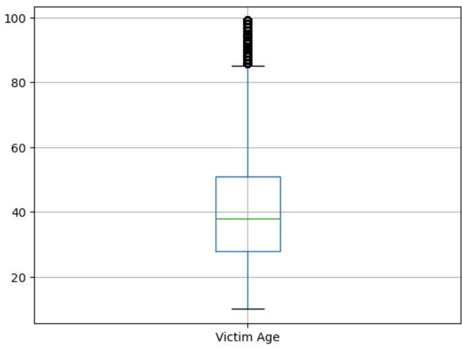

### Objectives:  
 - Load the data from a CSV file and into a dataframe object.  
 - Inspect the data.  
 - Clean the data.  
 - Prepare the data for analysis.  

### Description:  

Many states, counties and cities in the U.S. have web sites where they make data available. The data used for this project was retrieved from the Los Angeles city link provided below. <br>

https://data.lacity.org/Public-Safety/Traffic-Collision-Data-from-2010-to-Present/d5tf-ez2w

#### Data Dictionary - fields available in the csv file


#### Import Libraries and Load the Dataset
```
# load libraries
import pandas as pd
import numpy as np

# set up notebook to display multiple output in one cell
from IPython.core.interactiveshell import InteractiveShell
InteractiveShell.ast_node_interactivity = "all"

df = pd.read_csv("Traffic_Collision_Data.csv")

# look at the first 5 records
df.head()
```

  

```
# look at the fields and data types
df.info()
```


```
# see null count
df.isnull().count()
```


##### Observations from first five records and .info()
- DR Number should be unique
- Date Reported and Date Occurred are mm/dd/yyyy - not Date fields, but Objects
- Is Crime Code all 997?
- Is Crime Code Description all TRAFFIC COLLISION?
- MO Codes are more than one in the field separated by a space. What do they mean?
- Victim age is a float and there are nulls
- Victim Descent is one character code 
- Are Premise code and Premise Description all the same?
- Location has lat/long in same field separated by comma 

```
# view data without a scroll bar
print(df.head())
```


```
# Are there any duplicates
df['DR Number'].nunique()

# comparing rows to each other shows there are duplicates
df.duplicated().sum()
```

**OUTPUT:**  
566747

2642

```
# Isolate year to see what is included in the data
# Note that we are creating a new column in the dataframe
df['Year'] = pd.to_datetime(df['Date Occurred']).dt.year

# sort by year
df['Year'].value_counts().sort_index(ascending = True)
```

**OUTPUT:**  


```
# Area Name looks good - not sure about Reporting District
df['Area Name'].value_counts()

# Over 1000 different reporting districts
df['Reporting District'].nunique()
df['Reporting District'].value_counts()
```

**Value Counts: Area Name**  


**nunique & value counts: Districts**  


```
# all the same, we can drop these columns later
df['Crime Code'].value_counts()
df['Crime Code Description'].value_counts()
```


```
#  null ages and there is some dirty data in ages
df['Victim Age'].value_counts(dropna = False) #will show NaN too

# ten year old driver!
df['Victim Age'].describe()

df['Victim Age'].hist()
```


```
# visually look at data
df.boxplot(column = 'Victim Age')
```



##### Victim Age analysis

- The histogram shows a blip near 100
- The boxplot shows potential outliers at the higher end of age
- After running the cell below, you can see that the age of 99 appears to be dirty data.  Since there are 39 people that are 98 years old, there are bound to be valid 99 years olds, but we don't know which ones, so we will eliminate 99 year olds from our data.


```
# create a subset of data to check out the ages
temp = df[df['Victim Age'] > 90]
len(temp)
temp['Victim Age'].value_counts()
```


```
# show data before delete of 7218 records
df.shape

# eliminate records
df = df[df['Victim Age'] != 99]

# check shape after elimination
df.shape
```

**OUTPUT**
(569389, 19)  

(562171, 19)

```
# look at victim gender values
df['Victim Sex'].value_counts(dropna = False)

# what is the precentage breakdown? Use normalize = True
df['Victim Sex'].value_counts(normalize = True, dropna = False)

# X is Unknown
# H and N are dirty data
```


#### LA Census Data:  


```
# look at descent by percent
df['Victim Descent'].value_counts(normalize = True, dropna = False)

# and by counts
df['Victim Descent'].value_counts()
```


```
# since the majority are the same, we can drop these columns later
df['Premise Code'].value_counts()
df['Premise Description'].value_counts()
```


```
# have some null locations. Lat and Long are separated by a comma.
df['Location'].value_counts()
```


Dropped all unneeded columns: Date Reported, Area ID, Crime Code, Crime Code Description, Premise Code, Premise Description, Address and Cross Street.  
Showed the dataframe shape before deleting columns and after deleting columns.<br>

```
#dataframe before del
df.shape
```
**OUTPUT**  
(562171, 19)

```
#dataframe after del
df.drop(columns = ["Date Reported", "Area ID", "Crime Code",  "Crime Code Description", "Premise Code", "Premise Description",  "Address", "Cross Street"], inplace = True)
df.shape
```
**OUTPUT**  

(562171, 11)

Drop duplicates - Show before and after shape.

```
#before drop na
df.shape

#after na drop
df.drop_duplicates(inplace=True)
df.shape
```

**OUTPUT**  

(562171, 11)  

(559577, 11)


Renamed columns to make them more clear and to prepare them for being loaded into a SQL database:<br>
    
1. Rename DR Number to DR_Number
2. Date Occurred to Date
3. Area Name to Division
4. Victim Age to Age
5. Victim Sex to Gender
6. Victim Descent to Descent
7. MO Codes to MO_Codes
8. Reporting District to Reporting_District
    
Displayed the dataframe with .info() to show the changes.

```
df.rename(columns = {"DR Number" : "DR_Number", "Date Occurred" : "Date", "Area Name" : "Divsion", "Victim Age" : "Age", "Victim Sex" : "Gender", "Victim Descent" : "Descent", "MO Codes" : "MO_Codes", "Reporting District" : "Reporting_District"}, inplace = True)

df.info()
```
