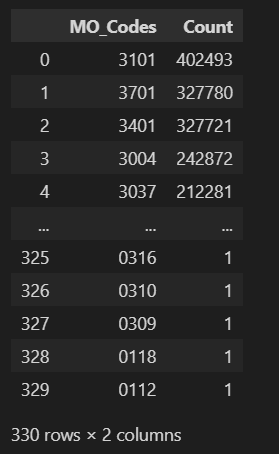

### Objectives
This exercise used data cleaned from project 4 in my Database and Perperation course:
- Load data from csv file into a DataFrame Object
- Analyze the data using SQL and Python
- Use sqlalchemy to load data stored in a DataFrame object into SQLite database engine
- Use sqlalchemy to connect to SQLite database engine to execute SQL queries
- Execute different SQL queries

#### Project setup:

```
# load libraries
import pandas as pd
import numpy as np
# https://docs.sqlalchemy.org/en/13/intro.html
import sqlalchemy
from sqlalchemy import create_engine

import matplotlib.pyplot as plt
import seaborn as sns

# set up notebook to display multiple output in one cell
from IPython.core.interactiveshell import InteractiveShell
InteractiveShell.ast_node_interactivity = "all"
```

```
# ------------------------------------------------------
# read in file from Previous Project
# ------------------------------------------------------
df = pd.read_csv("Final Traffic.csv")

# check out fields
df.info()
```


```
# look at the first 5 records
df.head()
```


#### Load traffic data into a table in a SQLite database

```
# 'engine' will be used to reference the database
engine = create_engine('sqlite:///LAtraffic.db')

df.to_sql('traffic', engine, if_exists = 'replace', index = False)
# check out columns in table
pd.read_sql_table('traffic', engine).columns
```

**OUTPUT**  

549547  

Index(['DR_Number', 'Date', 'Division', 'Reporting_District', 'Age', 'Gender',
       'Descent', 'Year', 'Month', 'Day', 'Hour', 'imputeAge', 'Latitude',
       'Longitude'],
      dtype='object')

#### Read in the MO file created earlier in project 4 and add to the database
  - Creating a table in the `LAtraffic` database called `MO_accident`

```
# specify that the codes column is a string, not an int so we don't lose leading zeros
mo = pd.read_csv("MO per accident.csv",dtype = {'MO_Codes':'str'})

mo.to_sql('MO_accident', engine, if_exists = 'replace', index = False)
# check out columns in table
pd.read_sql_table('MO_accident', engine).columns
```

**OUTPUT**  
3033153  
Index(['DR_Number', 'MO_Codes'], dtype='object')

#### Read in a file that contains all MO codes and a description of what they mean
  - Creating a table in the `LAtraffic` database called `MO_master`


```
# specify that the codes column is a string, not an int so we don't lose leading zeros
mo_mast = pd.read_csv("MO master.csv", dtype = {'Codes':'str'})

mo_mast.to_sql('MO_master', engine, if_exists = 'replace', index = False)
# check out the columns
pd.read_sql_table('MO_master', engine).columns
```
**OUTPUT**  
777  
Index(['Codes', 'Description'], dtype='object')

#### The three tables that are now saved into the `LAtraffic` database

```
from sqlalchemy import schema
xMetaData = schema.MetaData(bind = engine)
xMetaData.reflect()
# will show table names
xMetaData.tables.keys()
```
**OUTPUT**  
dict_keys(['MO_accident', 'MO_master', 'traffic'])

#### Simple query using * to select all columns

- Clean, easy-to-read code has main query commands each on a new line (SELECT and FROM on separate lines)
- SELECT specifies the columns in a table
- FROM specifies the table name
- engine refers to the database named in the create_engine cell

```
# using pandas read_sql_query returns a dataframe
q1 = pd.read_sql_query("SELECT * \
                        FROM MO_accident", engine)
q1.head()
```

  


#### Using SELECT for specific fields

- can individually pull out specific fields

```
q2 = pd.read_sql_query("SELECT Division, Gender, Age \
                        FROM traffic", engine)
q2.head(10)
```


#### Can count and group the results

- `Count(*)` will count the rows that qualify
- `AS` allows you to rename the result to a more user friendly column name (in this example 'Accidents')
- `GROUP BY` is how the counts are accumulated - in this case by MO_Codes

**SQL Aggregate Functions**
- COUNT:  returns number of values in a specific column
- SUM: returns the sum of the values in a specific column
- AVG: returns the average of the values in a specific column
- MIN: returns the smallest value in a specific column
- MAX: returns the largest value in a specific column

```
# count of MO codes
q3 = pd.read_sql_query("SELECT MO_Codes, count(*) AS Accidents \
                        FROM MO_accident \
                        GROUP BY MO_Codes ", engine)
q3
```


#### ORDER BY will determine the output order

```
# count of MO codes
q4 = pd.read_sql_query("SELECT MO_Codes, count(*) AS Count \
                        FROM MO_accident \
                        GROUP BY MO_Codes \
                        ORDER BY Count DESC", engine)
q4
```



#### Check out the MO_master table

```
# what is in the MO_master table?
query = "SELECT * \
         FROM MO_master"
q5 = pd.read_sql_query(query, engine)
q5.head(10)
```


#### Joining two tables using WHERE clause

- in the `WHERE` line below we are joining the **MO_accident** table with the **MO_master** table
- the two tables are being joined on the MO_Codes column of the MO_accident table and the Codes column of the MO_master table
- this type of join is called an Inner Join

```
# look at MO codes with descriptions
q6 = pd.read_sql_query("SELECT MO_Codes, Description, count(*) AS Count \
                        FROM MO_accident a, MO_master m \
                        WHERE a.MO_Codes = m.Codes \
                        GROUP BY MO_Codes \
                        ORDER BY Count DESC", engine)
q6.head(10)
```


#### Using JOIN to connect two tables

```
# same query as above but using JOIN to connect the tables
q6a = pd.read_sql_query("SELECT Mo_Codes, Description, count(*) AS Count \
                        FROM MO_accident a \
                        JOIN MO_master m ON a.MO_Codes = m.Codes \
                        GROUP BY MO_Codes \
                        ORDER BY Count DESC", engine)
q6a.head(10)
```


#### Using WHERE to select a subset of data

- equals: =
- not equals: <> or != 
- is less than: <
- is greater than: >
- is less than or equal to: <= 
- is greater than or equal to: >=

```
# isolating 2010 data
q7 = pd.read_sql_query("SELECT Month, count(DR_Number) AS Count \
                        FROM traffic \
                        WHERE Year = 2010 \
                        GROUP BY Month \
                        ORDER BY Month", engine)
q7
```


#### Logical Operators

- `AND`, `OR` and `NOT`
- Expressions are evaluated left to right
- Subexpressions in brackets are evaluated first
- NOT is evaluated before AND and OR
- AND is evaluated before OR

```
# isolating 2010 data along with Jan, Feb and March
q7a = pd.read_sql_query("SELECT Month, count(DR_Number) AS Count \
                        FROM traffic \
                        WHERE Year < 2011 AND Month < 4\
                        GROUP BY Month \
                        ORDER BY Month", engine)
q7a
```


#### BETWEEN and NOT BETWEEN

```
# isolating 2010 data
q7b = pd.read_sql_query("SELECT Month, count(DR_Number) AS Count \
                         FROM traffic \
                         WHERE Year < 2011 AND Month BETWEEN 1 and 4\
                         GROUP BY Month \
                         ORDER BY Month", engine)
q7b
```


#### IN and NOT IN

- Tests whether a data value matches one of a list of values
- Must be an exact match

```
q8 = pd.read_sql_query("SELECT Mo_Codes, Description, count(*) AS Count \
                        FROM MO_accident a, MO_master m \
                        WHERE a.MO_Codes = m.Codes AND \
                        Description IN ('T/C - Hit and Run Misd')\
                        GROUP BY MO_Codes \
                        ORDER BY Count DESC", engine)
q8
```


#### LIKE and NOT LIKE

- Searches for a string appearing somewhere within the data column

```
q9 = pd.read_sql_query("SELECT Mo_Codes, Description, count(*) AS Count \
                        FROM MO_accident a, MO_master m \
                        WHERE a.MO_Codes = m.Codes AND \
                        Description LIKE '%Hit%' \
                        GROUP BY MO_Codes \
                        ORDER BY Count DESC", engine)
q9
```


#### Use Latitutude and Longitude to do a quick analysis of accuracy of location data  
#### Cleaning data is iterative process

- the Latitude edges to Los Angeles appear to be 34.4 and 33.6
- the Longitude edges appear to be -118.7 and -118.1
- there are some outliers in our make shift map that need to be removed

```
z1 = pd.read_sql_query("SELECT Latitude, Longitude, Division \
                        FROM traffic", engine)
z1.head()
```


```
fig, ax = plt.subplots(figsize = (10,10))
ax = sns.scatterplot(x = 'Longitude', y = 'Latitude', hue = "Division", data = z1, legend = 'full')
```


#### The query below is selecting the data using SQL, but then using Python to summarize the findings

```
# query example used for requirement 1
q10 = pd.read_sql_query("SELECT Division \
                         FROM traffic", engine)

# now using python to summarize
q10['Division'].value_counts()
```


#### Using <b>SQL query only</b>, produce output similar to value_counts output that shows Division and the count for each division with the highest count shown first

```
r1 = pd.read_sql_query("""SELECT Division, COUNT(*) as Count 
                       FROM traffic
                       GROUP BY Division
                       ORDER BY Count DESC""", engine)
r1
```


#### Find the minimum, maximum and mean values for the Age column.  Do this only using <b>SQL</b>.

r2 = pd.read_sql_query("""SELECT MIN(Age) AS MinAge,
                            MAX(Age) AS MaxAge,
                            ROUND(AVG(Age), 3) AS MeanAge
                            FROM traffic""", engine)
r2


#### Find all Divisions with the word 'west' within the division title. Show the number of accidents in these Divisions.  Do this only using <b>SQL</b>. Sort with highest accident count showing on top.

```
r3 = pd.read_sql_query("""SELECT Division, COUNT(*) AS accidents 
                            FROM traffic
                            WHERE Division LIKE '%west%'
                            GROUP BY Division
                            ORDER BY accidents DESC""", engine)
r3
```


#### Analyze the accidents for teenagers, 16 to 19, and for the older group over 80.

1. Use SQL to select those in the age ranges described.
2. Based on percentage, how does the younger group differ from the older group by Gender? (Answer with Python)
3. Based on percentage, how does the younger group differ from the older group by Descent? (Answer with Python)

```
#Q1
r4 = pd.read_sql_query("""SELECT Gender, Age, Descent
                                    FROM traffic
                                    WHERE Age <20 OR Age BETWEEN 80 AND 98""", engine)

young = r4[r4['Age'] <20]
old = r4[r4['Age'] > 88]

print(10*'-', 'Gender Young', 20*'-')
young['Gender'].value_counts(normalize = True)

print(10*'-', 'Gender Old', 20*'-')
old['Gender'].value_counts(normalize = True)

print(10*'-', 'Desent Young', 20*'-')
young['Descent'].value_counts(normalize = True)

print(10*'-', 'Desent Old', 20*'-')
old['Descent'].value_counts(normalize = True)
```


**Summary:** When looking at gender by age group, the percentage of accidents is close(ish) to 50-50 split when comparing female young and old, and male young and old. However, it is clear that for those who identify as other gender is almost entirely in the teen category. For the breakdown of descent by age group it is more of mix. A majority of the accidents happening involving asian, black and white descents is seen with the 80 and older group. While hispanic, other and unknown descents are involving a mojority of the teen drivers.

#### Analysis on Hit and Run accidents. We saw that there are two MO codes that represent Hit and Run - 3029 and 3030. 
   
1. Use SQL to query all accidents with codes 3029 or 3030 along with the Division where the accident occurred.   
2. Compare the top 5 Divisions in Requirement 1 that included all accidents to the top 5 Divisions with Hit and Run accidents. How do these differ?

```
r5 = pd.read_sql_query("""SELECT t.Division, MO.MO_Codes AS MO_accidents, COUNT(*) as Count 
                            FROM traffic t
                            JOIN MO_accident AS MO
                            ON t.DR_Number = MO.DR_Number
                            WHERE MO.MO_Codes IN (3029,  3030)
                            GROUP BY Division
                            ORDER BY Count DESC""", engine)
            
r5.head()
r1.head()
```


**Summary:** When comparing the top 5 divisions with total accidents with the divisions with the most that were hit and run related all the divsions in the total count appear on the top 5 list of hit and run accidents. The only differefnce is seen with Newton at number five in the total count trade places with Wilshire at number 3 in the total count in hit and run accidents list.

#### Use SQL to only select valid latititude and longitudes.  Once you have the data, use matplotlib to plot latitude, longitude and use the Division for hue.
    
- the Latitude edges to Los Angeles appear to be 34.4 and 33.6
- the Longitude edges appear to be -118.7 and -118.1

```
lat_long = """SELECT Latitude, Longitude, Division
                FROM traffic
                WHERE (Latitude BETWEEN 33.6 AND 34.4)
                AND (Longitude BETWEEN -118.7 AND -118.1)
"""
# Load the data into a pandas dataframe
data = pd.read_sql_query(lat_long, engine)

fig, ax = plt.subplots(figsize = (10,10))
ax = sns.scatterplot(x = data['Longitude'], y = data['Latitude'], hue = data['Division'], data = z1, legend = 'full')
```


#### Are the imputed records the same as the non-imputed records?  Select imputeAge, Gender and Descent.

- Compare Gender for imputeAge (imputed vs non-imputed records). Would you consider the imputed records to be similar to non-imputed in regards to Gender?
- Compare Descent for imputeAge (imputed vs non-imputed records). Would you consider the imputed records to be similar to non-imputed in regards to Descent?

```
r7 = pd.read_sql_query("""SELECT Descent, Gender, imputeAge
                        FROM traffic""", engine)

x1 = pd.DataFrame(pd.crosstab(r7['Gender'], r7['imputeAge'], margins=True, margins_name='Totals'))
x1
```


```
#Calc percentages down columns for gender

x1 = pd.DataFrame(pd.crosstab(r7['Gender'], r7['imputeAge'], normalize = 'columns'))
x1
```


```
#Calc percentages down columns for descent
x2 = pd.DataFrame(pd.crosstab(r7['Descent'], r7['imputeAge'], normalize = 'columns'))
x2
```


#### Have hit and run accidents increased or decreased over time?  Is the change over time the same in all Districts?

1. Select only non-imputed rows for both types of Hit and Run accidents that occurred 2010-2020.
2. Show the count of accidents for each District for every year.  How you show the data is up to you.
3. In a Markdown cell, explain if the data is showing you that Hit and Run accidents are mosting increasing or decreasing in different districts?  Which districts saw increases in 2020 over previous year?
4. In a Markdown cell, explain what you see with 2010 and 2011 and suggest what can be done with these years?

```
r8 = pd.read_sql_query("""SELECT *
                            FROM MO_accident a, traffic t
                            WHERE a.DR_Number = t.DR_Number
                            AND (a.MO_Codes = '3029' or MO_Codes = '3030')
                            AND t.imputeAge = 0
                            AND t.Year BETWEEN 2010 AND 2020""", engine)
r8['Year'].value_counts()

#Heat Map
fig, ax = plt.subplots(figsize = (8,5))
sns.heatmap(pd.crosstab(r8['Division'], r8['Year']),
           cmap = 'Purples', annot = True, cbar = True, fmt = 'g');
```


```
r8_2 = pd.read_sql_query("""SELECT Division, Year, Count (*) as Count
                            FROM MO_accident a, traffic t
                            WHERE a.DR_Number = t.DR_Number
                            AND (a.MO_Codes = '3029' or MO_Codes = '3030')
                            AND t.imputeAge = 0
                            AND t.Year BETWEEN 2010 AND 2020
                            GROUP BY Division, Year""", engine)


#Line Plot
plt.style.use('seaborn')
fig, ax = plt.subplots(figsize = (10, 7))
ax = sns.lineplot(data = r8_2, x = 'Year', y = 'Count', hue = 'Division')
ax.set_title('Hit and Run Accedents by Year and District');
ax.set_xlabel('Year');
ax.set_ylabel('Hit and Run Count')
```


**Summary:** The data suggests that hit and run accidents are increasing in frequency. However, the year 2020 shows a steep drop off likely due to the pandemic leading to less driving. This change over time generally does follow a pattern in all districts except for the districts that saw increases in 2020 over the previous year, which include 77th Street and Southeast. For the year 2010 and 2011 the data is either missing or very small in comparision to the other years' frequencies. I would want to know more about these years data collection and what happend here. At the very least the data should not be used to make inferences but should prabably be dropped.

#### Look at Ages of drivers across the years.  Are these complete enough to do an Age analysis?
   
1. Select for all accidents types.
2. Show Age counts for each year.


```
r9 = pd.read_sql_query("""SELECT Age, Year
                        FROM traffic """, engine)

x9 = pd.DataFrame(pd.crosstab(r9['Age'], r9['Year']))
x9
```


**Summary:** Based on the that was queried it looks as though it is complete enough to do an age analysis.

#### Your choice of what question to ask of this data. What are you still curious about? Consider alternative ways to look at this data that has not already been explored.
    
1. Clearly state your question in a Markdown cell.
2. Show the code for your answer.
3. Clearly state your interpretation of the findings in another markdown cell.

#### The hour data has not yet not been explored. Examine the hour data to gain insight on the time of day accidents are occuring.
    
    1. Group the hour data into 4 different time blocks of the day.
        Monring: 4 - 9
        Day: 10 - 16
        Evening: 17 - 23
        Night: 24 - 3
        
     2. How does the time of day differ by division?

```
r10 = pd.read_sql_query("""SELECT DR_Number, Division, Hour, Count(*) AS Accidents
                                    FROM traffic
                                    GROUP BY HOUR, Division                                   
                                   """, engine)

#Morning totals by division
morning = r10[(r10['Hour'] >= 4) & (r10['Hour'] <= 9)].groupby('Division')['Accidents'].sum()

#Day totals by division
day = r10[(r10['Hour'] >= 10) & (r10['Hour'] <= 16)].groupby('Division')['Accidents'].sum()

#Evening totals by division
evening = r10[(r10['Hour'] >= 17) & (r10['Hour'] <= 23)].groupby('Division')['Accidents'].sum()

#Night totals by division
night = r10[(r10['Hour'] >= 0) & (r10['Hour'] <= 3) | (r10['Hour'] == 24)].groupby('Division')['Accidents'].sum()

#Concat all accidents within the time ranges into a df by division:
divis_df = pd.concat([morning, day, evening, night], axis=1, keys=['Morning', 'Day', 'Evening', 'Night']).reset_index()
divis_df
```


**Summary:** The summary table is a good illustration into when accidents are occurring in a given time block. As expected the 'Day' and 'Evening' (hour 10-23) time blocks have the highest accident counts because this is most likely when people out driving. If this were not the case we would want to know about it, and grouping by division would point us to that area for further investigation. The morning time block has a higher accident count than the night time block which makes sense because of morning commuters. A few more things to note: 77th Street area in the day time block has the highest total accident count and the evening time block is a close second. This may a cause for concern and should be investigated further. Is this a very busy area, or does this area have dangerous roads/intersections? Also, it is worth noting that there are many divisions that have a much larger accident count in the day and evening time blocks comparted with their respective morning and night time blocks. This leads me to believe these are commuter spots of the LA area where we see lots of people coming into the area but leaving in off hours.