### Objective:  
This portfolio project, undertaken as part of my database course, focuses on analyzing retail data from a simulated store. The project involves loading the retail data into a SQLite database, enabling seamless interaction with the dataset. Using SQL queries, various analyses and operations are performed on the data, ranging from aggregate functions and data cleaning to complex joins and insightful data analysis. Through this project, I gained hands-on experience in database management, query optimization, and data analysis techniques, all of which are essential skills for a career in data science or database engineering

### ERD

The Entity-Relationship Diagram (ERD) serves as a visual representation of the normalized database structure, illustrating the relationships between entities and their attributes. By depicting the schema in a clear and organized manner, the ERD facilitates understanding of the database design and enables efficient querying of the data. It not only helps in identifying the entities and their attributes, but also highlights the relationships between them, such as one-to-one, one-to-many, or many-to-many connections. Thus, the ERD serves as a crucial tool for database developers, analysts, and was relied upon to aid in this project.

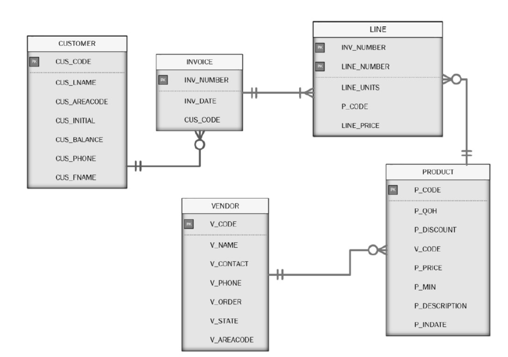

1.	How many invoices are there? List the invoice numbers and the invoice dates.  
Answer - 8 Invoices

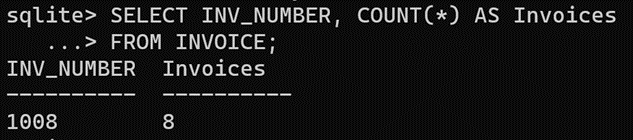

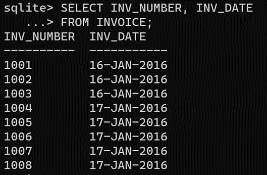

2.	How many customers are there? List the customer codes and customer names.  
Answer – 10 Customers

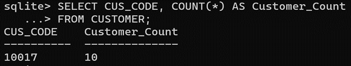

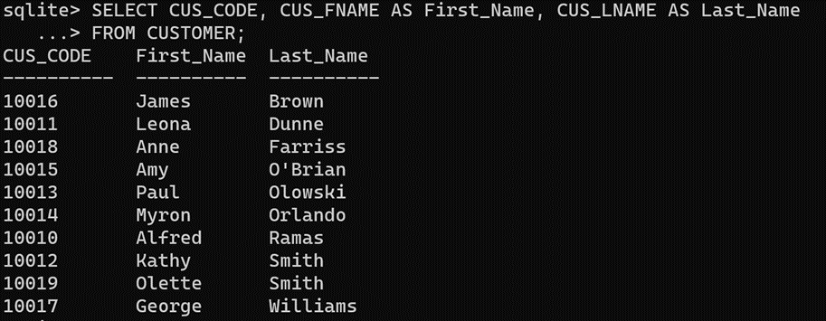

3.	List vendor numbers and vendor names. Show the vendor count per state. 

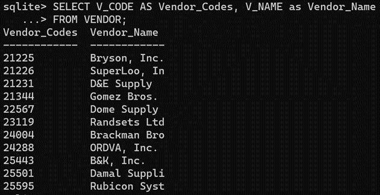

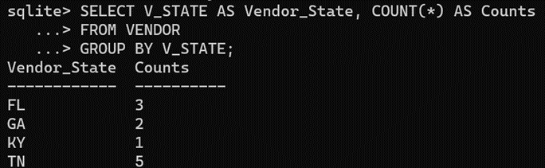

4.	Based on price, what is the most expensive product? How much quantity on hand is available for the most expensive product?  
Answer – 16 inch hicut chain saw with 11 in stock

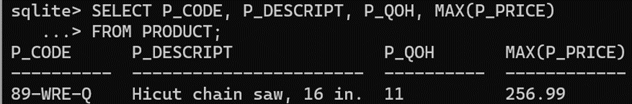

5.	Display the product description, quantity on hand, and price for all products that have a discount greater than 5%.

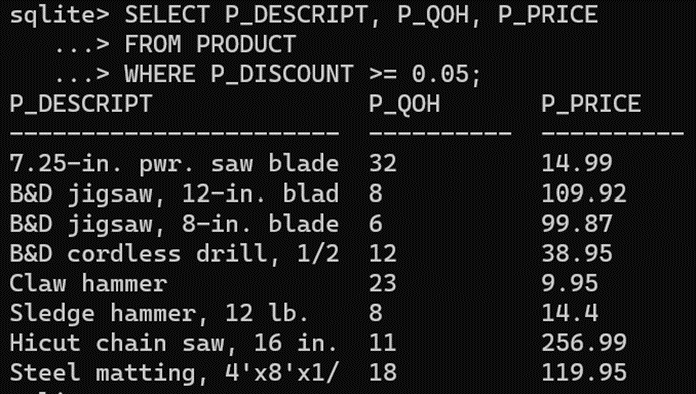

6.	Generate a listing of products offered by each vendor. List vendor name, product code and product name. Sort by vendor name and product code.

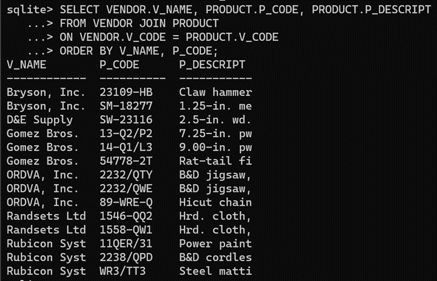

7.	What is the average discount (rounded to the nearest cent) given by each vendor.

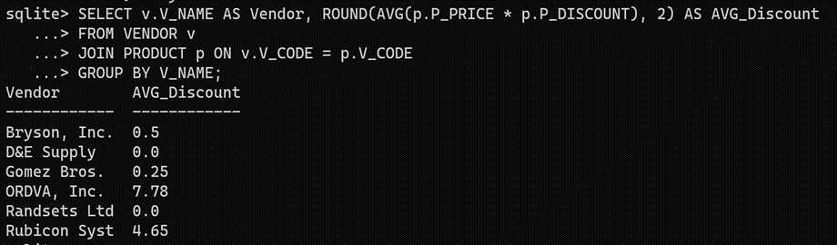

8.	What is the vendor with most "products on hand" for a particular product? What is the vendor with most "products on hand" for all its products combined? List both the vendor name and the number of products. Is it the same vendor in both cases?  
Answer – D&E Supply, Yes

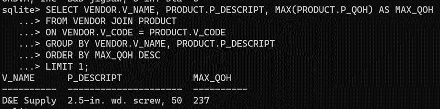

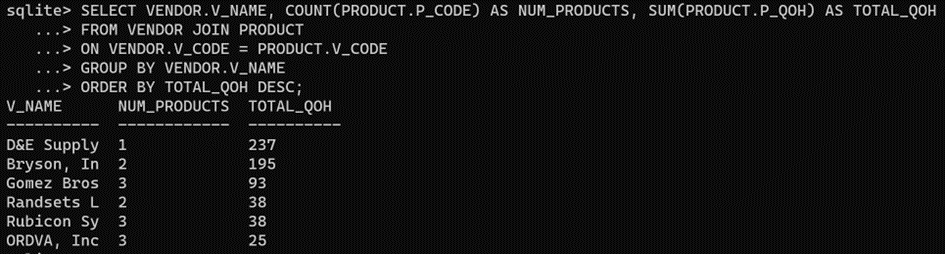

9.	Generate a listing of customer purchases, including the subtotals for each of the invoice line numbers; sort output by customer code, invoice number and the line_number.

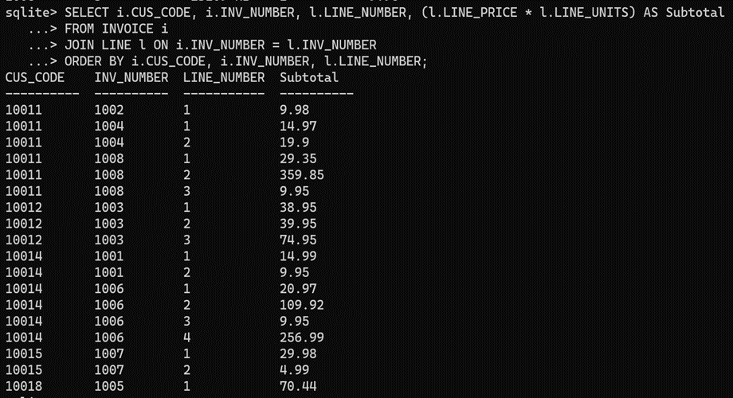

10.	List the total amount spent by each customer who made purchases during the current invoice cycle—that is, for the customers who appear in the INVOICE table; sort by customer code.

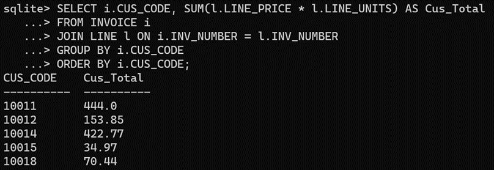

11.	Find a listing of customers who did not make purchases during the invoicing period; sort by customer code.

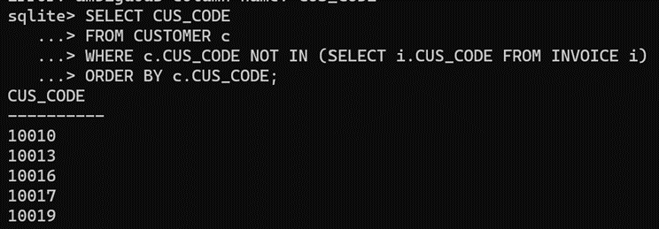

12.	Create a query to produce a summary of the value of products currently in inventory.

**Total value of all inventory on hand by vendor**

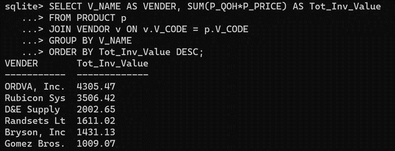

**Total value of inventory by product on hand by vendor**

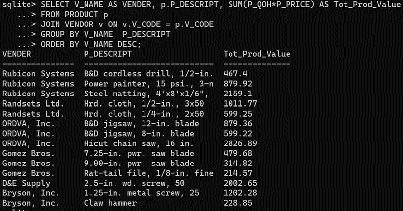